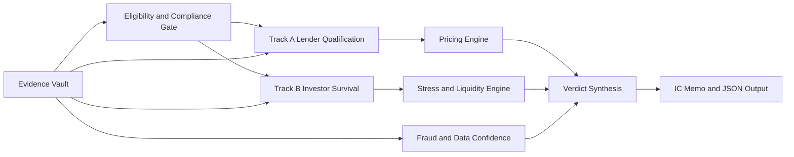
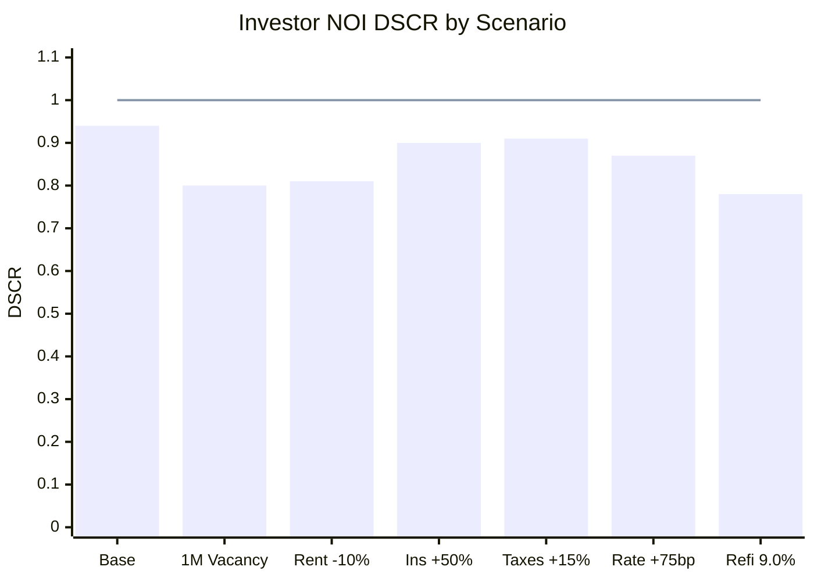

# Dual-Track DSCR Truth Engine

## Executive summary

A production-ready **Dual-Track DSCR Truth Engine** should compute two separate answers for every deal and never blend them into one ratio: **Track A, Lender Qualification**, which answers “can this loan close under a lender matrix?” and **Track B, Investor Survival**, which answers “should this investor own this asset under realistic operating economics and debt stress?” That separation is not just good UX; it is the core control that prevents a property from being labeled “good” simply because it qualifies on a lender’s rent-to-payment formula. Public DSCR programs still qualify borrowers primarily from property cash flow, and Regulation Z treats credit for non-owner-occupied rental property as business-purpose credit, while owner-occupied rentals require separate analysis. citeturn8search2turn17search1turn1search1turn1search3

The reason to split the tracks is visible in the source documents themselves. Agency-style rental qualification rules commonly use simplified treatments such as **75% of lease or market rent** to absorb vacancy and maintenance, while many DSCR lenders market variants of **rent ÷ PITIA** with lender-specific rent caps or adjustments. Those rules are acceptable for underwriting qualification, but they are not a substitute for a true NOI model. Recent securitization presales also show how fragile “paper DSCR” can be: one S&P presale for a Verus investor-loan pool reported that 89.44% of the pool balance was property-focused DSCR investor loans with a weighted-average DSCR of 1.10, while 63.04% of those properties had **no lease in place** and instead relied on estimated rents; the same presale reported 3.82% of loans 30 days delinquent as of cutoff. citeturn26view0turn13search0turn18search0turn15search3

The best platform therefore needs six things at once: a deterministic lender-calculation engine; a realistic NOI and liquidity engine; debt-structure modeling for interest-only, ARM, reset, and balloon risk; a stress-testing layer; a fraud/data-confidence layer; and a final verdict and remediation layer. The uploaded “Godmode Blueprint” is directionally correct on the architectural essentials: separate the math tracks, preserve evidence provenance, compare true all-in loan costs rather than just note rate, and produce committee-grade outputs rather than consumer-calculator screens. fileciteturn0file0

The practical recommendation is to ship the engine with **four scores** and **four verdicts**, not one. The four scores are **Lender Qualification**, **Pricing Efficiency**, **Investor Survival**, and **Data Confidence**. The four verdicts are **Underwriting**, **Pricing**, **Survival**, and **Action**. If the system cannot populate one of them with high-confidence evidence, it should say “Unspecified / Requires Broker Matrix” rather than fabricate precision from stale public advertising or incomplete guidelines. That design principle is especially important because public program pages can conflict with each other and change frequently. citeturn22view4turn7view0

## Architecture and source hierarchy

### Core design principle

At system level, the engine should have a deterministic spine with three ordered stages: **eligibility and compliance gates**, **parallel Track A and Track B computations**, and **verdict synthesis with remediation**. That architecture is materially better than a monolithic DSCR calculator because the inputs, formulas, and acceptable evidence are not the same for each question. The uploaded blueprint explicitly argues for this separation and for an evidence-backed “vault” of claims rather than hard-coded, decaying constants. fileciteturn0file0



### Required inputs

The production schema should be opinionated. It should require the following inputs, while allowing any field to remain explicitly **unknown** rather than silently defaulted.

| Input domain | Required fields for production | Why required |
|---|---|---|
| Property | Occupancy intent, address, unit count, property type, HOA, acreage, rent-control flag, condo/condotel status, appraisal date | Eligibility, valuation, rent treatment, overlays |
| Borrower and vesting | Natural person vs entity, guarantors, FICO(s), experience, citizenship/residency, financed-property count, ownership seasoning | Matrix matching, reserves, legal routing |
| Transaction | Purpose, purchase price, appraised value, as-is / as-completed if applicable, loan amount requested, CLTV, seller concessions, escrows | LTV, pricing, cash-to-close, state/high-cost checks |
| Debt structure | Product type, fixed/ARM, IO term, amortization, margin, index, caps, balloon term, prepay schedule, points/fees | Track A payment math, reset and exit modeling |
| Rent evidence | Lease, transferability, deposit evidence, 1007/1025/72/1000, Schedule E / 8825, rental AVM, STR trailing statements, STR market study | Rent hierarchy and confidence scoring |
| Operating economics | Taxes, reassessment method, insurance quote, utilities, management, repairs, capex, turnover, licensing, platform fees, furnishings | Track B NOI accuracy |
| Liquidity | Verified post-close liquid reserves, planned rehab, other pledged capital, contingent liabilities | Survival runway |
| Data provenance | source_url, source_type, verified_date, freshness, reviewer, confidence, superseded_by | Auditability and anti-decay controls |

This input design is consistent with the official evidence lenders and agencies already require. Fannie Mae’s rental-income rules distinguish lease, appraisal, Schedule E, and business tax return evidence; Freddie Mac likewise requires comparable-rent analysis and defines reserves off the monthly payment amount. The uploaded blueprint’s evidence-vault idea is the right implementation pattern for those facts. citeturn25view0turn26view0turn13search0turn13search1

### Rent-source hierarchy

The engine should not store “rent” as one field. It should store **all candidate rent figures**, their source types, and their confidence. A robust hierarchy is:

| Rank | Rent source | Recommended platform use | Confidence rule |
|---|---|---|---|
| Highest | Current lease **plus** deposit evidence | Use for near-term realized rent | High if bank/deposit proof exists |
| High | Current lease supported by 1007/1025 or Freddie rent form | Use for stabilized LTR rent | High if within tolerance |
| High | Schedule E / Form 8825 trended actuals | Use for existing stabilized rentals | High for seasoned assets |
| Medium | Appraiser market rent only | Use when unleased or recently acquired | Moderate |
| Medium | Rental AVM | Use prequal / scenarioing only unless lender explicitly allows | Moderate, product-specific |
| Medium | STR trailing twelve months from platform/bank deposits | Use for STR actuals after normalization | Moderate-high if complete |
| Lowest | STR market study / AirDNA / projection only | Use with haircuts and Data Confidence penalties | Low-moderate |

Agency guidance is explicit that lease, tax-return, and appraisal forms are different evidentiary paths, and Fannie requires one-unit subject-property rent support through Form 1007 or the new rental section under UAD 3.6, with Form 1025 for two- to four-unit properties. Fannie also requires evidence that lease terms are actually in force, such as two months of rental-payment deposits or the security deposit plus first month’s rent. Freddie’s guide similarly requires 75% rent treatment and comparable-rent analysis. citeturn25view0turn26view1turn13search0turn19search0turn11search49

Two implementation notes are critical. First, **do not hard-code Form 1007 as a permanent requirement**; Fannie’s UAD 3.6 policy moves market-rent reporting into the revised appraisal workflow and says Form 1007 is generally not used except in rare exceptions. Second, **do not force a single rent rule across lenders**: Kiavi publicly states it uses the lower of **110% of appraised market rent** and a valid lease; Easy Street describes the widely used “lower of in-place and market rent” convention; LendingOne’s public broker guideline uses the lesser of actual or market rent, subject to a cap at 120% of market rent; Angel Oak offers rental AVM, appraiser STR analysis, and AirDNA analysis on certain DSCR paths. citeturn19search0turn21view0turn16search0turn4search48turn22view2

### Source priority for production

The system should source data in this order:

| Priority | Source class | Production rule |
|---|---|---|
| First | Official lender matrices / lock desk / program guides | Source of truth for Track A |
| Second | Fannie/Freddie selling guides and appraisal forms | Source of truth for agency-style rent evidence and reserve logic |
| Third | CFPB / Regulation Z / ARM/balloon definitions | Source of truth for business-purpose gating and debt-feature definitions |
| Fourth | Rating-agency presales and surveillance | Use for market calibration, stress ranges, and confidence penalties |
| Fifth | Appraisal, rent AVM, lease deposits, tax and insurance quotes | Use for property-specific evidence |
| Sixth | Secondary market blogs, calculators, broker summaries | Use only as secondary corroboration |

The rationale is straightforward: public lender marketing is helpful but incomplete; rating-agency and performance data are valuable but not lender-specific rules; and secondary summaries should never overwrite primary guidance. The uploaded blueprint’s “evidence vault” is the appropriate control mechanism here, including a confidence score and supersession trail per claim. fileciteturn0file0

## Track A lender qualification specification

### Eligibility gate

Track A starts with a binary gate. If the transaction is not an eligible business-purpose investor loan, calculation should stop and the file should route to manual review or a different product. Regulation Z’s official commentary says credit to acquire, improve, or maintain **non-owner-occupied rental property** is deemed business-purpose credit, while owner-occupied rental property is subject to separate unit-count and factual tests. Section 1026.43’s ATR/QM standards likewise do not apply to extensions of credit primarily for business, commercial, or agricultural purposes. citeturn1search1turn1search3

Minimum eligibility questions therefore are: non-owner-occupied vs owner-occupied; property type; one- to four-unit vs mixed-use or commercial; purpose; vesting; state restrictions; and whether the lender program allows the borrower class, property type, and geography. Public lender pages reinforce the same boundaries: Visio emphasizes that DSCR loans are for non-owner-occupied 1–4 unit investment properties; Deephaven states its DSCR program is for investment properties and business purposes only. citeturn16search1turn6view0

### Exact lender math

The engine should implement lender qualification as a family of formulas, not a single formula. The **default DSCR lender template** is:

```text
Qualifying Debt Service = PITIA
PITIA = Principal + Interest + Taxes + Insurance + HOA/Association dues

Lender DSCR = Qualifying Rent / PITIA
```

That general formulation is visible in current lender materials from Kiavi, Angel Oak, Visio, and Easy Street. citeturn8search2turn17search1turn4search3turn8search1

However, Track A must preserve **program-specific rent and payment logic**. For example, some lenders qualify off a normal amortizing PITIA; some expose an interest-only calculation path; agency-style methodologies often use **75%** of gross monthly rent; Kiavi publicly markets the lower of **110% of appraised market rent** and the valid lease rent; Angel Oak exposes fixed and interest-only DSCR outputs in its calculator and also offers no-DSCR variants; Easy Street describes the common “lower of in-place and market rent” convention and notes that some lenders qualify using the interest-only payment when an IO option is chosen. citeturn26view0turn21view0turn22view1turn16search0turn17search1

A production-safe abstraction is:

```text
Qualifying Rent = lender_rule(rent_sources, property_type, lease_status, STR_status)
Qualifying Payment = lender_rule(product_terms, IO_flag, ARM_flag, taxes, insurance, HOA)
Track A DSCR = Qualifying Rent / Qualifying Payment
```

The engine should also expose the exact path used, for example:

| Field | Example output |
|---|---|
| Borrower claimed rent | $3,600 |
| Current lease | $3,400 |
| Appraiser market rent | $3,300 |
| Lender qualifying rent rule | lower(valid lease, 110% of market) |
| Lender qualifying rent used | $3,400 vs $3,630 cap → **$3,400** |
| Qualifying payment rule | full PITIA |
| Qualifying payment used | $2,662.57 |
| Track A DSCR | 1.28x |

That type of traceability is the difference between an underwritable engine and a black-box calculator. citeturn21view0turn17search1

### Publicly visible program examples

The table below is best treated as **representative public evidence as of 2026-06-17**, not a substitute for a lock-desk matrix.

| Public program example | Publicly visible FICO / DSCR / LTV | Public reserve or doc clues | Product clues | Source |
|---|---|---|---|---|
| Kiavi DSCR Rental Loans | DSCRs as low as **0.8x**; up to **80% LTV** | Public page says **no minimum liquidity requirements**; uses valid lease and appraised rent treatment | 30-year fixed, 5/1 and 7/1 ARM, IO, no prepayment penalty after year 3 | citeturn21view0 |
| Angel Oak DSCR | Minimum FICO **680** shown publicly for up to 75% LTV purchase/refi; max **85% LTV** at 720 FICO purchase; DSCR **<1.0** and no-DSCR options | 1007 waiver with rental AVM at prequal for 1-unit up to 75% LTV; STR appraiser analysis and AirDNA analysis | 30-year fixed, 5/6 ARM, 7/6 ARM, IO | citeturn22view0turn22view1turn22view2turn22view3 |
| Deephaven public DSCR pages | Public webpage shows minimum FICO **640**, up to **80% LTV** purchase/rate-term and **75%** cash-out; one-page flyer shows minimum DSCR **1.0**, FICO **660**, cash-out **70%** | Public DSCR guideline requires business-purpose affidavit; DSCR page states proceeds can be used for reserve requirements | 15-year fixed, 30-year fixed, 30-year fixed I/O, 5/6 ARM, 5/6 ARM I/O; STR with 12 months history in flyer | citeturn22view4turn22view5turn22view6turn7view0 |
| LendingOne broker guideline | Minimum DSCR **1.10** for FICO ≥720 and **1.20** for FICO <720; max loan **$2 million** | Appraisal plus **1007** plus **CDA**; escrows required; borrower must already own at least one investment property | Multiple PPP options; lesser of actual or market rent with 120% market-rent cap | citeturn4search48 |

The Deephaven conflict is not a bug in this report; it is the lesson. Public pages and flyers can disagree on the same lender’s FICO floor and cash-out limits, which is exactly why production systems should store lender claims with **source type, date, and confidence**, not as naked constants. citeturn22view4turn7view0turn0file0

### Representative program tiers for platform defaults

Because not every lender publishes a complete live matrix, the platform should support **representative tiers** for initial scenarioing and quote routing:

| Representative tier | Typical public profile | Suggested production defaults |
|---|---|---|
| Prime DSCR | 720+ FICO, DSCR ≥1.20 to 1.25, 75% to 80% LTV | Use for best-price routing, lower pricing penalties, 6–9 months reserves |
| Core DSCR | 680–719 FICO, DSCR 1.00 to 1.20, 75% to 80% LTV | Use as baseline tier, 6–12 months reserves |
| Flex DSCR | 660–700+ FICO, DSCR <1 or no-DSCR allowed, lower leverage | Use with strong pricing penalties, higher reserve requests, tighter Data Confidence thresholds |
| STR specialty | Higher documentation and rent-evidence variance | Require trailing-12 and/or market-study corroboration, stronger stress tests, 9–12 months reserves |

Those tiers are consistent with the public programs above, but they should remain **routing heuristics** until replaced by concrete lender evidence. citeturn21view0turn22view1turn7view0turn4search48

## Track B investor survival specification

### Correct investor formula

Track B should not reuse the lender numerator and denominator. The correct production formula is:

```text
Potential Gross Rent
- Vacancy and collection loss
+ Other income
= Effective Gross Income

Effective Gross Income
- Operating expenses
= Net Operating Income

Investor NOI DSCR = Stabilized NOI / Annual Debt Service
```

The key accounting rule is that if taxes, insurance, HOA, management, repairs, and reserves are deducted in NOI, they should **not** also sit in the DSCR denominator. Otherwise the model double-counts expenses. This distinction is consistent with investor-style DSCR tools that use NOI against annual debt service, even though lender qualification often uses rent against PITIA. citeturn2search3turn17search1turn8search1

### Expense categories and production defaults

Lender qualification often ignores many real-world costs. Easy Street says that in typical DSCR underwriting, the expenses included in the lender ratio are taxes, insurance, and HOA, not items like repairs, maintenance, or utilities. Agency guidance folds vacancy and maintenance into a 25% haircut rather than itemizing them. That is exactly why Track B needs a real expense model. citeturn8search1turn26view0turn13search0

Recommended production defaults for **long-term rentals** are below. These are **platform defaults**, not legal rules.

| Expense / assumption | Default | Recommended range | Comment |
|---|---:|---:|---|
| Vacancy | 5.0% of scheduled rent | 3%–10% | Base economic vacancy |
| Collection loss | 0.5% | 0%–2% | Higher for weaker tenant pools |
| Management | 8.0% of EGI | 6%–10% | Use even if self-managed |
| Repairs & maintenance | 4.0% of EGI | 3%–8% | Older assets trend higher |
| Capex reserve | 4.0% of EGI | 3%–8% | Roof/HVAC/appliances/plumbing |
| Turnover / leasing | 2.0% of scheduled rent | 1%–4% | Higher in seasonal markets |
| Legal / admin / accounting | $300 per year | $200–$1,000 | Small but persistent |
| Utility allowance | market- and lease-dependent | case-specific | Zero only if tenant-paid and verified |
| Property taxes | use **post-sale** estimate | case-specific | Do not rely on seller’s legacy bill |
| Insurance | use bindable quote | case-specific | Add separate shock test |

For **short-term rentals**, do not shoehorn the asset into an LTR template. The model should use ADR, occupancy, platform fees, cleaning, supplies, utilities, local taxes, licensing, and furnishing replacement. Angel Oak’s public DSCR program supports both appraiser-completed STR analysis and AirDNA-based paths; Deephaven’s flyer allows STR income with 12 months documented history; Visio warns that seasonal overestimation is a common DSCR deal breaker. citeturn22view2turn7view0turn16search1turn16search6

### Debt-structure modeling

Debt structure is not a footnote. The engine should model **fully amortizing**, **interest-only**, **ARM**, **ARM+IO**, and **balloon** structures explicitly.

For a fully amortizing payment:

```text
Monthly P&I = L × r / (1 - (1 + r)^(-n))
```

Where `L` is loan amount, `r` is monthly rate, and `n` is remaining amortization months.

For interest-only:

```text
Monthly IO Payment = L × note_rate / 12
```

For an ARM reset:

```text
Fully Indexed Rate_t = Index_t + Margin
New Rate_t = bounded by initial, periodic, and lifetime caps/floors
Reset Payment_t = payment on remaining balance at New Rate_t over remaining amortization
```

For a balloon:

```text
Balloon Balance_t = Remaining principal after scheduled payments through balloon date
```

These are not optional abstractions. The CFPB’s ARM guidance states that the index plus margin determines the post-reset rate, subject to caps, and that the payment is typically recalculated when the rate adjusts. The CFPB also defines interest-only loans as loans where the balance does not decline during the IO period and balloon loans as shorter-term loans with a large final payment. citeturn0search5turn0search6turn12search1turn12search2turn12search0

A sound production requirement is to compute, for every non-fixed fully amortizing loan:

| Debt feature | Required outputs |
|---|---|
| IO | current payment, recast payment, payment-cliff %, DSCR before and after recast |
| ARM | current rate, fully indexed rate, capped reset rate, reset payment, DSCR at each reset |
| Balloon | remaining balance at maturity, required refinance rate/LTV/DSCR to take out balloon |
| Prepay | penalty cost at each month in hold period |
| Hold-period economics | all-in effective yield and exit friction |

Public lender pages make these features practically relevant: Kiavi markets ARMs, IO, and side-by-side scenario comparisons; Deephaven and Angel Oak both market ARM and IO DSCR products. The uploaded blueprint is also right that note rate alone is an inadequate basis for quote ranking. citeturn21view0turn22view3turn22view6turn0file0

### Stress-test scenarios and parameter ranges

The engine should run deterministic shock tests by default and allow probabilistic overlays later. Minimum recommended production set:

| Scenario | Default range | Purpose |
|---|---:|---|
| Pre-close rate slippage | +25 / +50 / +75 bps | Lock risk |
| Reset / refinance rate stress | +100 / +200 bps | ARM or exit risk |
| Vacancy shock | +1, +2, +3 months equivalent | Tenant loss / leasing lag |
| Rent decline | -5%, -10%, -15% | Market softness |
| Insurance shock | +25%, +50%, +100% | Renewal shock |
| Tax shock | post-sale reassessment, then +10% / +25% | Assessment and jurisdiction risk |
| OpEx inflation | +10%, +20%, +30% non-tax/non-insurance | Margin compression |
| Capex event | $5k / $10k / $25k | Roof/HVAC/plumbing/etc. |
| STR conversion | STR to LTR market rent | Regulatory and demand shock |
| Liquidity shock | reserves burn with no outside support | Survival runway |

These ranges are stricter than lender qualification because they are meant to model lived economics, not just credit-box eligibility. They are also justified by current risk indicators: Cotality reports persistent elevated fraud risk in investment and multifamily applications, and rating-agency presales show meaningful use of estimated rents and explicit loss penalties for DSCR<1 and no-ratio loans. citeturn11search0turn11search7turn18search0turn18search5

## Scoring, fraud, and remediation logic

### Fraud and data-quality controls

The Data Confidence layer should be separate from both tracks. It should answer: **How much should the platform trust the inputs?**

Priority checks should include:

| Check | Why it matters | Evidence standard |
|---|---|---|
| Lease actually in force | Prevents fictional or stale rent | Lease plus deposits or security deposit/first month evidence |
| Appraisal review variance | Detects inflated value / rent support | CDA / review product and tolerance |
| Post-sale tax estimate | Prevents seller-tax carryover error | county assessor or mill-rate estimate |
| Insurance bindability | Prevents placeholder premium underquote | bindable quote |
| Occupancy/business-purpose consistency | Compliance gate | affidavit, vesting, purpose |
| Undisclosed debt / properties | Common investor-fraud vector | credit, title, property report |
| STR evidence completeness | Prevents peak-season overstatement | 12 months platform/bank statements |
| Source freshness | Prevents decayed matrices | verified_date threshold |

Fannie requires that lease-based qualifying income be supported by rent evidence such as two consecutive bank statements or security deposit and first month’s rent. Deephaven’s DSCR guideline requires a Clear Capital CDA or like product and sets a 10% review tolerance; if variance exceeds tolerance, further appraisal action is required. Cotality’s Q1 2026 fraud report says investment-property applications had indications of fraud at **1 in 44**, versus **1 in 129** overall, and that undisclosed real estate remains the largest rising category. citeturn26view1turn23view0turn11search0

### Four-score system

The score system below is designed for production and is intentionally explicit.

| Score | Weighting method | Hard caps |
|---|---|---|
| **Lender Qualification** | Eligibility 20, DSCR cushion 25, LTV tier 20, FICO tier 15, reserves adequacy 10, documentation completeness 10 | Any hard ineligibility caps score at 0–39 |
| **Pricing Efficiency** | AEY spread to best eligible quote 35, points/fees 20, PPP burden over hold period 20, structural fit to hold period 15, reserve/cash burden 10 | If fewer than two comparable quotes and no benchmark curve, score = N/A |
| **Investor Survival** | Base NOI DSCR 30, monthly free-cash-flow margin 15, liquidity runway 15, deterministic stress-pass rate 25, reset/refi/balloon risk 15 | Base NOI DSCR <0.85 or runway <3 months caps at 0–39 |
| **Data Confidence** | Rent evidence 25, valuation confidence 20, tax/insurance/HOA accuracy 15, borrower/entity/title/fraud 20, freshness/provenance 10, cross-source consistency 10 | Unresolved occupancy conflict or unverifiable rent caps at 0–39 |

Recommended interpretation thresholds:

| Score band | Interpretation |
|---|---|
| 85–100 | Strong |
| 70–84 | Pass / watch |
| 55–69 | Conditional |
| 40–54 | Weak |
| below 40 | No-go / manual exception only |

For **Pricing Efficiency**, the platform should use **AEY/XIRR over the intended hold period** instead of note rate alone. That recommendation is stronger than using APR alone because the CFPB itself warns that APR is imperfect for comparing adjustable-rate loans, while prepayment penalties materially alter total cost. The uploaded blueprint’s recommendation to compare true all-in effective cost rather than superficial rate is the right architecture. citeturn20search1turn20search0turn20search7turn0file0

### Truth matrix and action logic

The platform’s final verdict should be synthesized through a 2×2 decision matrix:

|  | Investor Survival passes | Investor Survival fails |
|---|---|---|
| **Lender Qualification passes** | **Green deal** — close if pricing is acceptable | **Trap deal** — qualifies, but should be restructured or declined |
| **Lender Qualification fails** | **Structuring opportunity** — adjust leverage/rent evidence/product/lender | **Kill deal** — do not proceed |

Recommended remediation levers should be ranked by impact on both tracks:

| Lever | Track A impact | Track B impact | Typical use |
|---|---|---|---|
| Lower purchase price | Strong positive | Strong positive | Best first lever |
| Increase down payment / lower leverage | Strong positive | Strong positive | Fastest structural fix |
| Rate buydown | Positive | Positive | Good if basis is modest |
| Switch ARM/IO to fixed or vice versa | Can help or hurt | Can help or hurt | Use only after payment-cliff analysis |
| Improve rent evidence | Positive | Neutral to positive | Only if evidence is real |
| Add verified reserves | Mild | Strong | Improves runway, not NOI |
| Shift to another lender matrix | Positive | Neutral | Solves Track A, not bad economics |
| Cure appraisal/value issues | Positive | Positive | Required if valuation is weak |
| Remove or soften PPP | Neutral to mild negative on rate | Positive on exit flexibility | Important for short holds |
| Kill the deal | Final | Final | When both tracks fail |

The uploaded blueprint’s “Unspecified / Requires Broker Matrix” rule is also correct here: if a remediation depends on an unpublished lender overlay, the system should say so. fileciteturn0file0

## Worked example and production report layout

### Hypothetical deal assumptions

The example below is intentionally chosen to show the most valuable outcome: **lender approves, investor should not close as structured**.

| Field | Assumption |
|---|---:|
| Property type | 1-unit long-term rental |
| Purchase price | $400,000 |
| Appraised value | $400,000 |
| Loan amount | $300,000 |
| LTV | 75.0% |
| Note rate | 7.00% fixed |
| Term / amortization | 30 years |
| Taxes | $5,000 annually |
| Insurance | $1,800 annually |
| HOA | $1,200 annually |
| Borrower claimed rent | $3,600/mo |
| Current lease | $3,400/mo |
| Appraiser market rent | $3,300/mo |
| Lender rule | lower of lease and market rent |
| Investor stabilized rent | $3,300/mo |
| Liquidity after close | assumed 6 months PITIA equivalent |

The rent hierarchy is realistic and consistent with public lender and agency practice: the borrower may claim more than the lease, the lease may exceed market, and the lender typically limits qualifying rent to some function of valid lease and market rent. citeturn16search0turn21view0turn4search48turn25view0

### Step-by-step calculation

**Track A: lender qualification**

Monthly principal and interest on a $300,000, 30-year loan at 7.00% is **$1,995.91**.  
Monthly PITIA is:

- P&I = **$1,995.91**
- Taxes = **$416.67**
- Insurance = **$150.00**
- HOA = **$100.00**

So monthly **PITIA = $2,662.57**.

Using lender-eligible rent of **$3,300**:

```text
Track A DSCR = 3,300 / 2,662.57 = 1.24x
```

That is a likely lender pass for many mainstream DSCR programs, though not necessarily a top pricing band. The formula and rent treatment are consistent with current public DSCR lender materials. citeturn8search2turn16search0turn17search1

**Track B: investor survival**

Production defaults used for this example:

- Vacancy = 5.0%
- Management = 8.0% of EGI
- Repairs & maintenance = 4.0% of EGI
- Capex reserve = 4.0% of EGI
- Turnover/leasing = 2.0% of scheduled rent
- Legal/admin = $300/year
- Taxes, insurance, HOA are included in OpEx

Calculation:

```text
Potential Gross Rent = 3,300 × 12 = 39,600
Vacancy (5%) = 1,980
Effective Gross Income = 37,620

Management (8% of EGI) = 3,009.60
Maintenance (4% of EGI) = 1,504.80
Capex reserve (4% of EGI) = 1,504.80
Turnover/leasing (2% of gross) = 792.00
Taxes = 5,000
Insurance = 1,800
HOA = 1,200
Legal/admin = 300

NOI = 22,508.80
Annual debt service (P&I only) = 23,950.89

Track B NOI DSCR = 22,508.80 / 23,950.89 = 0.94x
Monthly free cash flow after debt service = -$120.17
```

This is the essential dual-track outcome: **Track A passes at 1.24x, Track B fails at 0.94x**. The gap exists because lender qualification is using market/lease rent against PITIA, while survival uses real operating costs and excludes double-counting by placing taxes/insurance/HOA in NOI rather than in the denominator. The need for this decomposition is exactly what agency rental rules and public DSCR lender formulas leave unresolved. citeturn26view0turn17search1turn8search1

### Stress-test table

| Scenario | Investor NOI DSCR | Monthly free cash flow | Result |
|---|---:|---:|---|
| Base case | 0.94x | -$120 | Fail |
| One extra vacant month | 0.80x | -$395 | Fail |
| Rent -10% | 0.81x | -$377 | Fail |
| Insurance +50% | 0.90x | -$195 | Fail |
| Taxes +15% | 0.91x | -$183 | Fail |
| Entry rate +75 bps | 0.87x | -$274 | Fail |
| Refi/reset at 9.0% | 0.78x | -$538 | Kill |

**Stress chart for the hypothetical deal**



### Final truth matrix and action

| Final state | Verdict |
|---|---|
| Lender Qualification | **Pass** |
| Investor Survival | **Fail** |
| Truth matrix quadrant | **Trap deal** |
| Recommended action | **Restructure before closing** |

Recommended first-order fixes on this example:

| Fix | Approximate effect |
|---|---|
| Reduce loan amount to about **$268,500** | Raises investor NOI DSCR to about **1.05x** |
| Equivalent price reduction at same 75% LTV: about **$42,000** | Similar effect |
| Rate reduction of about **60 bps** on same loan | Roughly moves base investor NOI DSCR to **1.00x** |
| Verified stabilized rent of about **$3,500/mo** | Roughly moves base investor NOI DSCR above **1.00x** |
| Add reserves only | Improves runway, but does **not** fix negative base economics |

These remediation outputs are exactly what the action layer should generate automatically. In this case, the best recommendation is **lower leverage or lower basis**, not a softer lender matrix. citeturn21view0turn20search0turn20search7

### Illustrative four-score output

Assuming the example also has a transferable lease, deposit evidence, appraisal plus secondary review inside tolerance, and two lender quotes for pricing comparison, a production output could look like this:

| Score | Example score | Why |
|---|---:|---|
| Lender Qualification | 81 | Eligible, 1.24x qualification DSCR, 75% LTV, acceptable but not premium band |
| Pricing Efficiency | 63 | Hypothetical quote set is not best-in-market on all-in cost over intended hold |
| Investor Survival | 44 | Base NOI DSCR below 1.00 and every major stress case fails |
| Data Confidence | 86 | Good rent evidence, appraisal support, and clean cross-source traceability |

### UI and report layout

The output should be both **machine-readable JSON** and a human-readable **IC Memo / PDF**. The uploaded blueprint is correct that the highest-value artifact is not a toy calculator screen but a committee-grade memo with explicit kill-switches and quote comparison. fileciteturn0file0

Suggested report layout:

| Report section | Must contain |
|---|---|
| Summary header | 4 verdicts, 4 scores, truth-matrix quadrant, key assumptions, date/time, source freshness |
| Deal snapshot | Property, borrower, purpose, vesting, loan terms, cash to close |
| Track A | Rent-source trace, qualifying payment trace, matrix tier, pass/fail reasons |
| Pricing | At least two eligible quotes, note rate, APR, points, PPP, AEY over intended hold |
| Track B | EGI, full expense table, NOI, base cash flow, runway |
| Stress page | Deterministic scenario table, chart, ARM/IO/balloon cliffs |
| Data / fraud page | Evidence list, conflicts, confidence penalties, freshness, manual-review flags |
| Action page | Ranked remediation levers with estimated effect on each score |

Two additional UI rules are worth adopting. First, any variable that is not verified should display as **Assumption**. Second, any lender rule without current primary-source evidence should display as **Unspecified / Requires Broker Matrix**, not a guessed value. That is the right product posture for a platform that may be used in real credit decisions. fileciteturn0file0
