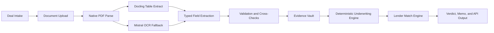
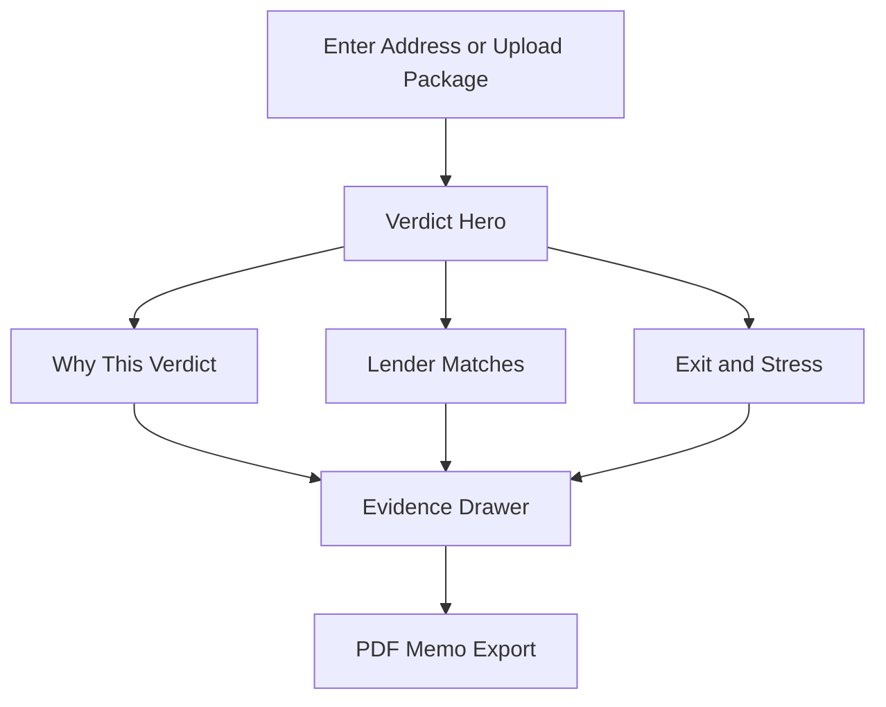

# DSCR Deal Desk Build-Ready Research Report

## Executive summary

The most defensible opportunity is not “another DSCR calculator.” It is an explainable, state-aware, lender-matching underwriting system that can turn a deal address and a small amount of borrower context into a lender-ready verdict, a reproducible evidence packet, and a short list of fundable executions in minutes. That positioning fits the actual market: by Polygon Research’s 2025 HMDA-based estimate, Non-QM reached about **$239.3 billion** across **697,605 loans**, roughly **10%** of U.S. mortgage originations, while KBRA’s decade-long Non-QM RMBS study found a weighted-average cumulative default rate of **3.8%** and realized credit losses averaging **0.03%**, which supports the case for better, faster, more disciplined investor-property underwriting rather than simplistic “calculator” experiences. citeturn2search0turn2search1turn1search0turn1search2

The requested scope is broad—deterministic DSCR, dual-track DSCR, lender intelligence, evidence vault, OCR intake, Monte Carlo/copula, AEY/pricing, reserves, STR, ARM/IO, compliance, PPE/vendor, warehouse/hedge, QC/securitization, UX, mobile, and PDF export—and the right answer is a staged system, not a monolith. The highest-confidence path is to build a deterministic underwriting core first, then wrap it with lender eligibility rules, evidence capture, explainable AI extraction, and capital-markets tooling. fileciteturn0file1

The strongest recommendation from the research is this: **the killer feature is not just better math; it is better explainability plus faster lender-fit execution**. Current lender sites and calculator tools show strong product specialization, but they are usually single-lender, single-workflow, or single-metric experiences. A market-leading DSCR Deal Desk should therefore deliver five things together: deterministic underwriting, lender-specific match/exclusion reasons, immutable source evidence, exportable committee-grade memos, and a compliance-safe explanation layer for declines and counteroffers. Official lender, regulator, and vendor documentation supports that bundle far more strongly than a generic “AI underwriter” pitch. citeturn4search3turn5search1turn5search5turn19search0turn19search6turn17search1turn18search2turn0search1turn6search1

## What will actually make the market switch

The biggest switching trigger will be **trustworthy certainty at the top of funnel**. A borrower, broker, AE, or credit lead does not mainly want a DSCR number; they want to know whether the deal clears likely lender overlays, what the fragile assumptions are, and what can be changed to make the deal fundable. Official lender materials show that DSCR programs vary materially on minimum DSCR, property support, short-term-rental treatment, LTVs, ARM/IO options, reserves, and documentation assumptions. That variability creates the opening for a multi-lender “decision desk” that tells users not merely “pass/fail,” but “fundable here, not there, because of these proven rule triggers.” citeturn3search2turn3search4turn5search1turn5search5turn4search0turn30search4

The second switching trigger will be **evidence-backed speed**. Mistral’s OCR documentation emphasizes structured extraction, table preservation, confidence scores, and batch processing for document-heavy flows, while Docling explicitly supports table extraction to CSV/HTML/DataFrame outputs. Those capabilities are exactly what a DSCR desk needs for appraisals, leases, insurance binders, LLC docs, and guideline PDFs. But OCR alone is not enough; the platform must attach every derived field to a source snippet and preserve the original file hash. That combination turns “AI intake” into something underwriters, auditors, investors, and warehouse partners can actually trust. citeturn12search0turn12search1turn16search0

The third switching trigger will be **pricing and execution intelligence, not just eligibility**. LoanPASS, Lender Price, and Optimal Blue all show that the market values configurable, API-driven product-and-pricing engines, investor comparisons, and secondary-market workflow automation. That is important evidence that the DSCR Deal Desk should not stop at “qualifies / doesn’t qualify.” It should rank executions by all-in economics, prepay structure, reserves drag, ARM/IO risk, and refinance path. In other words, the platform should sit between origination and capital markets, not just at the front form. citeturn17search1turn17search3turn18search2turn18search6turn19search0turn19search3turn19search6

The fourth switching trigger will be **compliance-safe explainability**. CFPB Circular 2022-03 and Regulation B are clear that adverse action reasons must be specific even when complex algorithms are used. That makes any opaque “black box” decline engine a structural weakness, not a moat. The winning product therefore needs deterministic reason codes underneath any AI layer: “DSCR below lender floor,” “short-term-rental evidence unsupported,” “cash-out seasoning short,” “state fee rule conflict,” “reserve shortfall,” and similar. The explainability requirement is not optional; it is core product architecture. citeturn0search1turn6search1

The fifth switching trigger will be a **real exit narrative**. DSCR buyers and brokers increasingly care about refinance timing, ARM reset risk, STR seasonality, portfolio leverage, and all-in effective yield. Official lender pages already market ARMs, IO, portfolio loans, refinance paths, and STR-specific qualification, but none of them provides a genuinely independent, comparative, institution-grade simulator for those decisions. That gap is where the DSCR Deal Desk can win. citeturn5search7turn4search0turn5search0turn5search5turn4search1

## Verification matrix by capability

The table below classifies each major capability using four statuses:

- **Verified**: directly supported by primary or official sources.
- **Market Pattern**: strongly supported by multiple market/official sources, but not always with a single controlling source.
- **Unverified**: plausible and useful, but not yet supported by enough primary evidence to hard-code as truth.
- **Rejected**: should not be treated as a product truth in the current design.

| Capability | Status | Research conclusion | What to build now | Key sources |
|---|---|---|---|---|
| Deterministic DSCR engine | **Verified** | Lender DSCR qualification is commonly modeled as monthly rent divided by PITIA; investor economics need NOI and debt-service views as separate tracks. | Build deterministic Track 1 and Track 2 first; no model inference in core math. | citeturn3search2turn4search3turn5search4turn4search5 |
| Dual-track and stabilized DSCR | **Market Pattern** | Lender qualification and investor economics are plainly different in lender materials; adding stabilized DSCR is productively differentiating but not an industry-standard lender requirement. | Ship three tracks: Qualifying DSCR, Economic DSCR, Stabilized DSCR. | citeturn3search2turn4search3turn5search4turn5search6 |
| Lender intelligence matrix | **Verified** | Program differences across DSCR lenders are material and current enough to justify rules ingestion. | Daily/weekly lender rules ingestion with effective-date versioning. | citeturn3search2turn3search4turn5search1turn5search5turn4search0 |
| Evidence vault | **Verified** | GLBA safeguards, FTC breach reporting, and ECOA explanation obligations make source traceability and access control product-critical. | Immutable evidence records with hashes, source links, extraction lineage, and access logs. | citeturn7search2turn7search3turn7search5turn6search1turn0search1 |
| AI intake and OCR | **Verified** | Structured OCR with table extraction, confidence scores, and batch support is available today from official vendors/open tooling. | Native PDF parse → Docling tables → OCR fallback for scans → typed extraction with validation. | citeturn12search0turn12search1turn16search0 |
| Monte Carlo with copula calibration | **Market Pattern** | Stress simulation is clearly valuable; heavy-tail dependence modeling is preferable to a naïve Gaussian-only default when joint downside matters. | Baseline with t-copula, keep Gaussian and independence as challenger models. | citeturn31search1turn31academia34turn24search2turn30search4 |
| Pricing, AEY, and execution ranking | **Market Pattern** | PPE vendors show the execution layer matters; borrower-comparable XIRR/AEY is useful, but it is an internal metric, not a regulatory APR substitute. | Build AEY and cost stack as internal ranking metric with timestamped pricing inputs and disclaimer. | citeturn17search1turn18search2turn19search0turn19search6 |
| Reserves engine | **Market Pattern** | Reserves are clearly lender- and risk-dependent; investor quality varies by lender. | Rules-based reserve stack: lender minimum + stress reserve + rehab/lease-up reserve. | citeturn3search4turn5search5turn1search0turn1search2 |
| STR underwriting | **Verified** | STR qualification using AirDNA or in-house projection models is real, but projection quality varies and needs confidence haircuts and LTR fallback. | Model STR with explicit source, haircut, confidence band, and LTR fallback track. | citeturn3search0turn5search0turn5search1turn30search0turn30search4 |
| ARM and IO analysis | **Verified** | Official lender materials show ARM and IO options are live DSCR products, especially for portfolio/rental investors. | Add ARM reset simulator, IO burn-off analysis, and refinance/break-even timing. | citeturn5search7turn4search0turn5search7 |
| State-aware compliance | **Verified** | Business-purpose loans are exempt from parts of RESPA/Reg Z, but ECOA, GLBA, and selected state statutes still matter. | Build jurisdiction engine with federal + state overlays and required notices. | citeturn6search0turn6search2turn6search1turn7search2turn28search2turn28search0turn29search4 |
| PPE / vendor interop | **Verified** | API-first pricing and investor connectivity are active market patterns. | Build adapter layer, not hard dependency on a single PPE. | citeturn17search3turn18search2turn19search6 |
| Warehouse / hedge | **Market Pattern** | Warehouse financing, pull-through, TBA hedging, and spec duration are real, but asset class treatment differs by lender/investor. | Build data hooks and dashboards, not fully automated hedge recommendations on day one. | citeturn21search8turn22search0turn22search1turn22search2 |
| QC and securitization readiness | **Market Pattern** | Rating-agency and diligence processes emphasize QC, due diligence, and operational controls. | Build exception logs, data lineage, and loan-level due-diligence package export. | citeturn23search1turn23search7turn23search8 |
| Hardcoded state tax, prepay, or fee assumptions | **Rejected** | State law and local tax treatment vary too much; hardcoded assumptions create silent compliance risk. | Dynamic rules tables only; no hidden static defaults. | citeturn10search0turn11search0turn10search3turn28search2turn28search0turn29search4 |
| Black-box decline engine | **Rejected** | Opaque adverse-action logic conflicts with specific-reason obligations. | Every decline and counteroffer must map to deterministic reasons and supporting evidence. | citeturn0search1turn6search1 |
| Gaussian-only copula as default enterprise model | **Rejected** | A Gaussian-only dependence model is too weak a default for joint downside if the goal is institutional stress realism. | Keep Gaussian as challenger; do not make it the only dependency model. | citeturn31search1turn31academia34 |

## Product requirements and technical architecture

### Core underwriting requirements

The underwriting core should be deterministic, auditable, and versioned. These formulas should be first-class product requirements.

| Module | Formula / rule | Inputs | Outputs | Precision / rounding |
|---|---|---|---|---|
| Qualifying DSCR | `qualifying_rent_monthly / PITIA_monthly` | lease/appraisal rent, PI, taxes, insurance, HOA | DSCR, pass/fail vs lender floor | compute at full precision; display to 2 decimals |
| Economic DSCR | `NOI_annual / annual_debt_service` | gross rent, vacancy, management, repairs, taxes, insurance, HOA, other opex, debt service | DSCR, cash flow, debt yield linkage | full precision; display to 2 decimals |
| Stabilized DSCR | `projected_year3_NOI / projected_year3_ADS` | growth assumptions, expected resets, future opex | future DSCR and trajectory | full precision; display to 2 decimals |
| LTV | `loan_amount / value_basis` | loan, appraised/purchase value by rule | LTV | full precision; display as percentage with 2 decimals |
| CLTV | `(first + second liens) / value_basis` | all liens, value | CLTV | full precision; display as percentage with 2 decimals |
| Debt yield | `NOI_annual / loan_balance` | NOI, loan | Debt yield | full precision; display as percentage with 2 decimals |
| Max loan by DSCR | `(rent / dscr_floor - TIHOA_monthly) / mortgage_constant` | DSCR floor, rate, term, taxes, insurance, HOA | Max eligible loan | round to nearest cent internally; nearest dollar for UI |
| Min rent by DSCR | `dscr_floor * PITIA_monthly` | DSCR floor, PITIA | Min required rent | cent internal; nearest dollar UI |
| Break-even occupancy LTR | `(opex_annual + ADS) / gross_potential_rent` | opex, debt service, GPR | occupancy threshold | display as percentage with 1 decimal |
| AEY | XIRR of borrower cash flows | net proceeds, points, fees, scheduled payments, prepay penalty assumptions, exit date | internal effective yield | compute to at least 1e-8; display bps and percentage |
| Refi break-even | upfront refi cost / monthly payment reduction | closing costs, point delta, payment delta | months to breakeven | 1 decimal month |

Two implementation rules matter more than they look. First, **every metric must carry a basis tag** such as `qualifying`, `economic`, `stabilized`, `stressed`, or `market_estimate`. Second, **every displayed figure must carry its source lineage**: manual input, OCR extraction, lender feed, tax authority rule, STR projection API, or internal simulation.

### Lender intelligence and source system requirements

The highest-value data model is a **versioned lender program rule set**. Each rule needs a source URL or document ID, an effective date, a confidence level, and an extraction method. Official lender sites show enough product variation to justify daily or weekly refreshes. For example, Griffin advertises DSCR qualification down to 0.75, no-ratio options, minimum FICO 620, and max LTV up to 85%; Kiavi states a minimum DSCR of 1.1 to prequalify; Visio publishes 41-state coverage and ARM/IO support; Lima One publishes up to 80% LTV for purchases/rate-term and 75% for cash-out, plus 5/1 and 10/1 ARMs and a 5-year IO structure; Easy Street highlights AirDNA-based STR qualification. citeturn3search2turn3search4turn5search1turn5search5turn4search0

A pragmatic source strategy is shown below.

| Source layer | Best use | Recommended cadence | Notes |
|---|---|---|---|
| Lender program pages and guides | floors, FICO, geography, property, ARM/IO, STR support | daily scrape + weekly human review | best source for current retail rules; must store effective dates citeturn3search2turn3search4turn5search5turn4search0 |
| NMLS Consumer Access | entity/license verification | weekly | searchable public licensing information, next-business-day updates from NMLS data feeds citeturn27search0turn27search1 |
| FEMA NFHL | flood flags and map evidence | monthly refresh or live query | official source for effective flood hazard map layers citeturn25search0turn25search1 |
| Census / FRED vacancy data | baseline market vacancy priors | quarterly | useful for priors, not property-level truth citeturn24search2turn26search0 |
| RentCast | property/rent AVM, tax history, comps | live API at intake and on manual refresh | useful for prefill and variance checks, not sole underwriting basis citeturn24search0turn24search1 |
| AirDNA | STR occupancy/ADR/revenue estimate | live API with timestamp | always use with confidence band and fallback logic citeturn30search0turn30search4 |
| PPE vendors | market pricing, investor connectivity | near-real-time API if licensed | use abstraction layer to avoid lock-in citeturn17search3turn18search2turn19search6 |

### OCR, evidence, and API design

The ideal processing chain is straightforward:



This architecture is supported by the current tooling landscape: Mistral provides structured OCR with markdown, tables, confidence scores, and batch mode; Docling supports table extraction into markdown/CSV/HTML/DataFrame flows; Instructor provides schema-first validated outputs; pgvector gives exact and approximate vector search inside Postgres, which is useful for guideline retrieval without a separate vector store. citeturn12search0turn12search1turn16search0turn13search0

A build-ready stack that balances speed and enterprise control is:

| Layer | Recommendation | Why |
|---|---|---|
| Frontend | Next.js 16 App Router | mature full-stack UI, modern caching, stable release, good DX citeturn15search0turn15search1 |
| API | Python + FastAPI | fast deterministic services, strong typing, finance/math ecosystem |
| Worker layer | Celery or Dramatiq with SQS/Redis | async OCR, simulations, exports |
| Database | Postgres + pgvector | structured storage, ACID, metadata + vector retrieval in one place citeturn13search0 |
| Object store | S3-compatible storage with KMS keys | immutable document and memo storage |
| OCR/extraction | Docling first, Mistral fallback | best blend of cost control and scan robustness citeturn12search0turn12search1 |
| Validation | Pydantic + Instructor | typed extraction, retries, schema enforcement citeturn16search0 |
| Hosting | AWS private workloads; optional Vercel frontend for low-risk presentation layer | Vercel has SOC 2 Type 2 and ISO 27001, but regulated document processing is cleaner in a private cloud boundary citeturn13search1turn13search5turn14search0 |

A minimal evidence object should look like this:

```json
{
  "evidence_id": "ev_01JDSCR8K6Z2H2M9T0A1",
  "case_id": "deal_2026_06_18_001",
  "source_type": "lender_guideline",
  "source_name": "Visio Lending",
  "source_url": "stored-internal-url-or-citation",
  "document_sha256": "5a7f...b91c",
  "retrieved_at": "2026-06-18T20:04:11Z",
  "effective_date": "2026-04-27",
  "field_name": "min_credit_score",
  "field_value": 680,
  "unit": "fico",
  "extraction_method": "ocr+typed_validation",
  "confidence": 0.97,
  "jurisdiction": "US",
  "lineage": [
    "uploaded_pdf_page_3",
    "ocr_block_18",
    "validator_rule_credit_score_floor"
  ],
  "human_review": {
    "required": false,
    "reviewed_by": null,
    "reviewed_at": null
  }
}
```

## Compliance and user experience deliverables

### Legal and compliance constraints

The platform should be designed around the following legal truths.

Business-purpose mortgage credit is generally exempt from **Regulation Z** and **RESPA** when it is primarily for a business, commercial, or agricultural purpose, which is materially helpful for DSCR investor lending. But that does **not** eliminate all compliance obligations. Regulation B still requires adverse-action notices and specific reasons, including for many business-credit applicants; CFPB has explicitly said complex algorithms do not excuse creditors from identifying specific and accurate principal reasons. GLBA privacy and safeguards requirements remain relevant for covered financial institutions, and the FTC’s updated Safeguards Rule includes specific security control expectations and breach reporting for certain non-bank financial institutions. citeturn6search0turn6search2turn6search1turn0search1turn7search2turn7search3turn7search5

State rules remain a live source of product risk and must not be flattened into a generic national default. Official examples show the point clearly. Ohio allows certain residential mortgage prepayment penalties up to one percent of original principal before five years, subject to carveouts. New Jersey broadly states that mortgage loans may be prepaid without penalty. Minnesota’s 2026 enactment creates a DSCR-related exception by excluding certain investment-purpose, non-owner-occupied purchase-money/first-lien/DSCR loans from subdivisions governing fees and prepayment penalties, effective August 1, 2026. California and Florida official assessor guidance also show that post-acquisition property tax assumptions can materially reset after transfer, which means tax estimates should not rely on the seller’s current bill. citeturn28search2turn28search0turn29search4turn10search0turn10search3turn11search0

Required default disclaimers should therefore include:

| Disclaimer area | Recommended language theme |
|---|---|
| Business purpose | “For non-owner-occupied investment/business-purpose scenarios only; owner-occupancy may trigger different legal treatment.” |
| Pricing | “Not a commitment to lend. Pricing and eligibility are indicative and time-stamped.” |
| AEY | “Internal comparative yield metric. Not a Regulation Z APR.” |
| STR | “STR revenue is estimate-based and may differ materially from realized performance.” |
| Taxes and insurance | “Local taxes, reassessments, premiums, and overlays may change at or after closing.” |
| Tax outputs | “Educational only; not tax, legal, or accounting advice.” |
| Adverse action | “Specific reasons available and recorded in the case file.” |
| Data provenance | “Outputs are based on the sources and assumptions shown in the Evidence section.” |

### UX deliverables that actually matter

The product should keep the advanced math, but present it in the order users decide. The single best interaction design is:

1. **Verdict hero**: proceed / restructure / pass, with three proof metrics.
2. **Scenario rail**: live toggles for rate, loan amount, rent, reserves, ARM/IO, hold period, and STR/LTR mode.
3. **Why panel**: exact pass/fail reasons, with evidence links.
4. **Execution panel**: two-quote recommendation plus ranked lender/refi options.
5. **Memo export**: one-click PDF package with assumptions, evidence, lender table, compliance notices, and alternate structures.

A compact wireframe description:

| Screen | Required elements | Mobile behavior |
|---|---|---|
| Verdict screen | verdict hero, qualifying/economic/stabilized DSCR, debt yield, AEY, reason chips | hero first, tabs below, scenario button fixed at bottom |
| Lender screen | ranked lenders, rule matches, exceptions, reserve requirement, notes | accordion cards, sticky compare CTA |
| Exit screen | refinance timing, ARM reset, AEY by hold, stress distribution, PDF export | horizontal cards, chart stacked below |
| Evidence drawer | source snippets, document thumbnails, hashes, timestamps | bottom sheet |
| Memo preview | branded PDF, evidence appendix, disclaimer block | read-only view with share/export |

A simple interaction map:



### Build tickets with acceptance tests

| Priority | Ticket | Effort | Acceptance test |
|---|---|---|---|
| P0 | Deterministic underwriting core | L | Given direct inputs, Track 1, Track 2, LTV, CLTV, debt yield, and break-even metrics match golden tests within tolerance |
| P0 | Lender rule schema and versioning | M | New lender rule file can be loaded with effective date, diffed against prior version, and queried by scenario |
| P0 | Evidence vault and hash storage | M | Every computed field returns at least one evidence record with immutable hash and retrieval timestamp |
| P0 | Adverse-action reason engine | M | Every decline/counteroffer returns at least one specific deterministic reason; no generic “internal policy” responses |
| P1 | OCR/extraction pipeline | L | Upload scanned and native PDFs; fields, tables, and confidence scores persist to evidence objects |
| P1 | STR module with confidence band | M | AirDNA or internal STR estimates produce base / haircut / severe cases with LTR fallback |
| P1 | Scenario rail | M | Adjusting rate, rent, reserves, ARM/IO mode, or hold period updates verdict and execution table in under 1 second for non-sim runs |
| P1 | Ranked lender match engine | L | Returns eligible, ineligible, and borderline lenders with exact rule reasons and reserve requirements |
| P1 | PDF memo export | M | Generates branded PDF with verdict, math, lender options, evidence appendix, and disclosures |
| P2 | Monte Carlo/stress engine | L | Produces P10/P50/P90 outputs, deterministic seed reproducibility, and scenario comparison view |
| P2 | Refi / ARM reset module | M | For ARM/IO loans, displays next reset payment, DSCR impact, and refi break-even months |
| P2 | Capital markets adapter layer | L | Plug-in can ingest PPE/vendor pricing without changing underwriting core contracts |
| P3 | Warehouse / hedge dashboard | M | Displays pull-through assumptions, execution channel, and hedge exposure metrics for selected pipeline cohort |
| P3 | QC / securitization package export | M | Loan package export includes data lineage, diligence fields, and exception log |

## Calibration, test suite, and delivery roadmap

### Monte Carlo calibration memo

The strongest research-backed default is a **t-copula baseline** with challenger models for **independence** and **Gaussian copula**. The reason is simple: if the platform is meant to quantify downside combinations such as rent softness plus vacancy plus exit cap widening plus ARM reset pressure, a Gaussian-only dependence model is too weak a default. The literature on Gaussian copula tail dependence is nuanced, but it still supports the practical conclusion that practitioners should prefer models with stronger downside dependence when extreme co-movement matters. citeturn31search1turn31academia34

Recommended design:

| Component | Recommendation |
|---|---|
| Dependence model | Student-t copula baseline; Gaussian and independence as challengers |
| Trial count | 50,000 per interactive run; 200,000 nightly calibration batch |
| Random seed policy | fixed seed for memo reproducibility; new seed for exploratory mode |
| Vacancy prior | local evidence first; otherwise Census/FRED vacancy priors by geography scale |
| STR occupancy / ADR priors | AirDNA monthly future estimates plus haircut bands |
| Rate path stress | deterministic shocks first; stochastic optional later |
| Output set | P10, P50, P90 DSCR; cash-flow shortfall probability; reserve exhaustion probability; refinance feasibility probability |
| Governance | monthly backtest on realized performance versus projected bands |

Suggested simulation pipeline:


A crucial product rule: **simulation may inform ranking, but it should never replace deterministic rule reasons**. If a lender floor is 1.10 and the qualifying DSCR is 1.03, the decline reason is the floor miss, not a probabilistic statement.

### Golden unit-test suite

A practical first suite should favor exact, human-checkable vectors.

| Test | Inputs | Expected output |
|---|---|---|
| Qualifying DSCR exact | Rent = 2,500; PITIA = 2,000 | DSCR = **1.25x** |
| Economic DSCR exact | NOI = 18,000; ADS = 15,000 | DSCR = **1.20x** |
| LTV exact | Loan = 300,000; Value = 400,000 | LTV = **75.00%** |
| CLTV exact | First = 300,000; Second = 40,000; Value = 400,000 | CLTV = **85.00%** |
| Debt yield exact | NOI = 18,000; Loan = 200,000 | Debt yield = **9.00%** |
| Break-even occupancy exact | Opex = 9,000; ADS = 15,000; GPR = 30,000 | Break-even occupancy = **80.0%** |
| Min rent by DSCR | DSCR floor = 1.25; PITIA = 2,000 | Min rent = **2,500** |
| Max PITIA by DSCR | Rent = 2,500; DSCR floor = 1.10 | Max PITIA = **2,272.73** |
| Cash flow monthly | EGI monthly = 2,600; Opex monthly excluding debt = 500; Debt service = 1,700 | Cash flow = **400** |
| Reserve months | Liquid reserves = 12,000; PITIA = 2,000 | Reserve months = **6.0** |
| AEY library alignment | fixed borrower cash-flow vector | must match Excel/XIRR reference within **1 bp** |
| ARM reset | known ARM index + margin + caps vector | payment and DSCR after reset match reference amortization engine within tolerance |

For all deterministic cases, the engine should store full precision and display rounded output only at the last moment. A safe default is:

- ratios: store float/decimal; display to 2 decimals,
- percentages: display to 2 decimals except occupancy-style thresholds at 1 decimal,
- currency: cent precision internally, nearest dollar on summary cards,
- AEY / rate deltas: store to 1e-8, display in bps and 3 decimals where needed.

### Risks and mitigation

| Risk | Why it matters | Mitigation |
|---|---|---|
| Rules drift | Lender programs change often | effective-date versioning, scheduled refreshes, human review queue |
| False OCR confidence | clean-looking extraction can still be wrong | confidence thresholds, field-level cross-checks, mandatory evidence links |
| STR overprojection | projection vendors can overstate weak or unique markets | haircut bands, LTR fallback, operator-quality adjustment, warning state |
| Compliance drift | state and federal interpretations change | jurisdiction service with legal-owner workflow and audit trail |
| Latency creep | OCR + sim + pricing can become slow | separate synchronous deterministic path from async enrichment path |
| Black-box temptation | product teams may want a “magic score” | require every recommendation to map back to deterministic reasons |
| Vendor lock-in | pricing/OCR providers change or become costly | adapter interfaces, source abstraction, internal normalized schema |
| Warehouse/capital markets overbuild | very sophisticated but low-adoption early features | keep phase one focused on underwriting + evidence + lender match |

### Open questions and limitations

Some important items remain partly unspecified or require customer-specific decisions rather than universal research conclusions:

- **Target launch date, budget, and team size** are unspecified.
- A **full 50-state fee/prepay/points matrix** should be treated as an ongoing legal-content program, not a one-time build.
- **Live investor rate-sheet ingestion** depends on commercial access to PPE/vendor APIs and lender partnerships.
- **Monte Carlo marginal calibration** should ultimately use the platform’s own realized outcomes, not only public proxies.
- **Warehouse and securitization workflows** are worth building, but they should follow—not precede—the deterministic underwriting, evidence, and lender-match core.

The core recommendation is therefore clear: build the **deterministic, explainable, evidence-backed, lender-matching DSCR desk first**. That is the shortest path to a materially better product than today’s calculators, lender portals, and spreadsheet workflows, and it is the part of the roadmap most strongly supported by the official sources. citeturn17search1turn18search2turn19search0turn19search6turn0search1turn6search1
