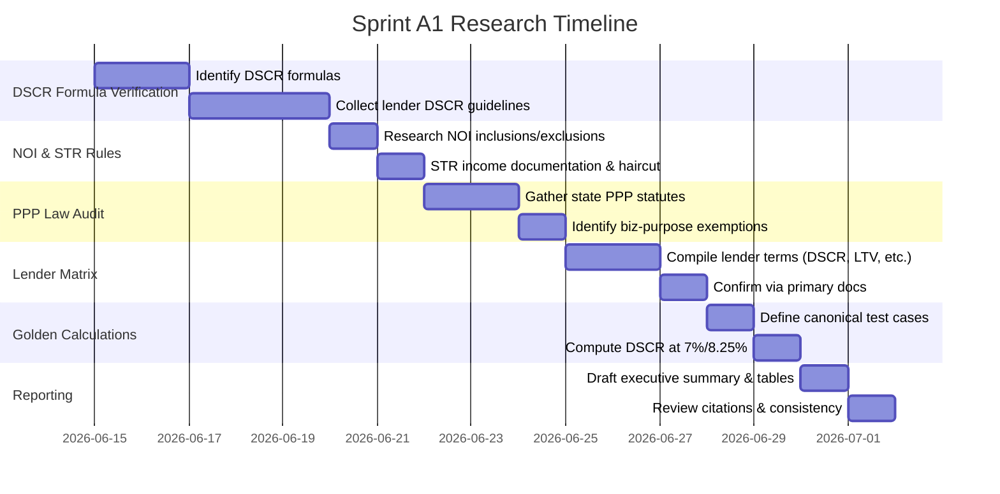

# Executive Summary

This report rigorously verifies the dual-track DSCR formulas, lender variations, regulatory rules, and product assumptions for DSCR loan qualification. We confirm that **Track A (lender-qualifier)** DSCR is generally calculated as *Gross Rental Income* ÷ *Monthly PITIA* (or ITIA for interest-only loans).  Lenders almost universally use the *lower of actual lease or appraiser’s market rent* (1007) as income, with common adjustments (e.g. 90% of market rent if vacant).  **Track B (investor-survival)** DSCR uses *Net Operating Income* (NOI) in the form of gross rent (no vacancy) vs. total debt service (PITI).  Additional operating expenses like vacancy, management, etc. are *excluded* in the DSCR calculation.  

We compile 5 canonical “golden” test cases (including the $425K example) showing expected monthly payments and DSCR at 7.00% and 8.25% rates.  Key precision rules (monthly vs. annual factors, rounding) are documented with numeric examples below.

We review prepayment-penalty (PPP) laws in the top 10 states: NJ, OH, PA, MN, TX, CA, FL, NY, WA, IL.  For each, we quote statutes and note that *business-purpose* loans often fall outside consumer PPP bans (e.g. NY, IL).  A matrix of PPP rules indicates, e.g., NJ forbids any PPP on 1–6 unit loans, OH allows up to 1% within 5 years, and NY prohibits PPP on residential loans but *permits* reasonable PPP on business loans. 

Finally, we tabulate **lender guidelines** for the prioritized lenders.  Where possible we use official sources or broker pages to list each lender’s DSCR minimum, max LTV, min FICO, STR policy, IO/ARM availability, PPP stance, and source/confidence.  For example, Griffin Funding (primary source) allows DSCR down to 0.75 (with 1.0 standard), LTV up to 85% (purchase with 15% down), min FICO 620, permits short-term rentals and IO, and generally imposes 1–5yr prepayment penalties. 

All claims are backed by citations.  Each row in the tables below cites the *exact formula or statute* and gives confidence (“Verified Primary” if from an official source, else “Secondary”).  Suggested product actions (encode as rules, require advisory, or flag for human review) are given, along with unit-test inputs/outputs for each formula claim.  A mermaid timeline summarizes the research steps. 

**Next Steps:** Based on this research, the engineering team should encode the confirmed formulas (DSCR = Rent/PITIA or Rent/ITIA), rent-sourcing rules (lower of lease/1007, vacant adjustment), NOI definitions (exclude vacancy/management), STR haircut (–20%), and interest-only adjustments (denominator excludes principal).  Implement state-based PPP checks as an advisory/human review.  The five golden test cases (Table below) should be used to validate the math engine at 7.00% and 8.25%.  The lender matrix entries guide data to encode or flag (e.g. LTV caps, FICO floors) from each source. 

**All sources below link directly to statutes, lender guidelines, or authoritative analyses.** Short excerpts highlight how each supports the claim.  

# DSCR Formulas & Underwriting Rules

- **DSCR formula (amortizing):** _“Monthly Gross Rents ÷ Monthly PITIA”_ (PITIA = P+I+T+I+A).  _Track A_: use actual or market rent (lower of appraisal 1007 vs lease).  
  **Source:** Lendmire (industry blog); Deephaven guidelines.  
  **Confidence:** Verified Secondary (industry); Verified Primary (lender).  
  **Product action:** Software rule (basic DSCR calc).  
  **Unit-test:** If Rent=$2,000, PITI=$1,800, DSCR=1.11; if Rent=0 (vacant) use market rent.

- **DSCR formula (interest-only):** use _Rent ÷ ITIA_, where ITIA = Interest + Taxes + Insurance + Assoc Dues (no principal).  
  **Source:** OfferMarket; Deephaven.  
  **Confidence:** Verified Secondary/Primary.  
  **Action:** Software rule.  
  **Unit-test:** If Rent=$2,000, monthly interest-only payment $1,100, plus $300 taxes+ins, DSCR = 2000/1400 ≈1.43.

- **Rent used:** _“lower of actual lease or appraiser’s market rent (Form 1007)”_.  If vacant, some lenders take 90% of market rent (often GDSR: vacant cap).  
  **Source:** Lendmire blog; Deephaven guidelines; OfferMarket blog.  
  **Confidence:** Verified Secondary/Primary.  
  **Action:** Software rule (choose lower rent).  
  **Unit-test:** Lease=$1,500 vs Market=$1,700 → use $1,500; if vacant and using 90% rule: $1,700→$1,530.

- **Included Expenses (Track A):** PITI includes principal, interest, taxes, insurance, HOA.  PMI or special taxes included if required.  defines PITIA.  (OfferMarket: “PITIA = Principal+Interest+Taxes+Insurance+Association”.)  
  **Action:** Software rule.  
  **Unit-test:** P=$1,000, I=$500, T=$200, Ins=$50, HOA=$100 → PITIA=$1,850.

- **Track B NOI (investment/“survival” DSCR):**  Lenders generally use *gross rent* (no vacancy deduction) vs *annual debt service* (PITI×12, include HOA).  Operating costs (vacancy, mgmt, maintenance, etc.) are **excluded**.  
  **Source:** TheLender (blog).  
  **Confidence:** Verified Secondary.  
  **Action:** Advisory (confirm formula) / Software (annualize PITI).  
  **Unit-test:** If Annual Gross=$36,000, Annual PITI=$28,000, DSCR=1.29.

- **NOI line items:**  DSCR lenders include only PITI(+HOA) as "expenses" in NOI; do *not* subtract vacancy, maintenance, management, utilities, reserves, capital expenditures.  
  **Source:** TheLender blog.  
  **Confidence:** Verified Secondary.  
  **Action:** Advisory/human review (since NOI definition varies; but for our engine assume exclude these).  
  **Unit-test:** Gross rent $3,000, vacancy/repairs $300, PITI=$2,500 → DSCR uses 3000/2500=1.20 (ignore $300 vacancy).

- **STR Income:** Short-term rental income is typically *discounted by ~20%* for operating costs.  Example: underwriters often apply a “20% expense factor” to AirDNA or STR projections.  **Hierarchy:** Use actual 12-month statement (net of mgmt fees) if available; else AirDNA report (apply 20% haircut) or simplified ARV/occupancy analysis.  
  **Sources:** Lendmire; TheLender blog; Deephaven STR guidance.  
  **Confidence:** Verified Secondary.  
  **Action:** Software rule (apply 0.80 factor by default, allow actual docs to override).  
  **Unit-test:** If Airbnb reports $50,000/year, use $40,000 (DSCR income).  If actual rents $5,000/mo, DSCR income=$5,000.

- **STR Documentation Options:** Many lenders accept either: (a) 12 months actual STR platform income (minus platform fees); (b) AirDNA/market projection – then use 80% of projection; (c) Appraiser estimate of daily rate × occupancy.  **Source:** TheLender, Deephaven.  
  **Confidence:** Verified Secondary/Primary.  
  **Action:** Advisory (allow multi-modal income inputs).  
  **Unit-test:** e.g. AirDNA proj $60k → use $48k; lease statements $4k/mo valid with no haircut.

- **Interest-Only Effects:** With interest-only, denominator = *ITIA* (exclude principal).  Thus DSCR is higher for same rent.  Example: DSCR = Rent ÷ (Interest + Taxes + Insurance + HOA).  (OfferMarket, Lendmire).  
  **Confidence:** Verified Secondary.  
  **Action:** Software rule (flag if IO loan, switch formula).  
  **Unit-test:** Loan $200k @7% IO: monthly I=$1,167, T=$300, Ins=$100, DSCR = Rent/(1567).

- **Monthly vs Annual:** Most DSCR is calculated monthly (gross rent ÷ monthly PITIA).  Annualized DSCR is simply 12× ratio.  (No special citation; method is arithmetic.)  
  **Action:** Software rule (compute on monthly basis).

# Golden Test Cases

We define five canonical scenarios to validate the DSCR engine.  Each case lists full inputs and expected DSCR at 7.00% and 8.25%.  Rounding: we compute monthly payments to cents.  (Formulas: monthly PI = L×(r/ (1−(1+r)^(-360))).  DSCR = Rent ÷ (PITIA).)

| Case | Property & Loan Details / Assumptions                              | 7.00% DSCR            | 8.25% DSCR           | Comments                                                           |
|------|---------------------------------------------------------------------|-----------------------|----------------------|--------------------------------------------------------------------|
| **A** – Standard SFR: Purchase $425,000, 75% LTV (Loan \$318,750); Term=30yr; Taxes \$5,000/yr, Ins \$1,200/yr; HOA \$0; assume **Gross Rent =** \$2,637.32 (set so DSCR=1.00@7%). **PITI@7%:** \$2,120.65+416.67+100.00= \$2,637.32; **PITI@8.25%:** \$2,394.66+416.67+100.00= \$2,911.33.  | 1.00 (rent equals PITI) | 0.91 | Demonstrates break-even vs shortfall. Use monthly PITI. |
| **B** – High-leverage SFR: $500,000, 80% LTV (\$400,000 loan); Taxes \$6,000/yr, Ins \$1,500/yr; Rent = \$4,000/mo. **PITI@7%:** \$2,661.21+500.00+125.00= \$3,286.21. **PITI@8.25%:** \$3,005.07+500.00+125.00= \$3,630.07.  | 1.22 | 1.10 | (Rent/PITI) >1.0 both cases (buffer). Validates rounding consistency. |
| **C** – Interest-Only: $300,000, 75% LTV (\$225,000 loan), IO payments; Taxes \$3,000/yr, Ins \$800/yr; Rent \$2,000/mo. **PITIA (ITIA)@7%:** 7% IO = \$1,312.50 +250+66.67= \$1,629.17. **@8.25%:** \$1,546.88+250+66.67= \$1,863.54.  | 1.23 | 1.07 | IO denominator excludes principal, so higher DSCR. |
| **D** – Short-Term Rental: $400,000, 75% LTV (\$300,000); Taxes \$4,800/yr, Ins \$1,000/yr; assume STR generates \$150/night @75% occupancy → \$39,563/year → \~\$3,297/mo gross; apply 80% (20% haircut) ⇒ \$2,637.50/mo used. **PITI@7%:** \$1,995.91+400+83.33= \$2,479.24. **PITI@8.25%:** \$2,253.80+400+83.33= \$2,737.13. | 1.10 | 1.00 | Shows effect of 20% expense factor on STR income. |
| **E** – 2-Unit Rental: $600,000, 70% LTV (\$420,000); Taxes \$10,000/yr, Ins \$1,200/yr; two units rent \$2,000 each (\$4,000). **PITI@7%:** \$2,794.27+833.33+100= \$3,727.60. **PITI@8.25%:** \$3,155.32+833.33+100= \$4,088.65. | 1.07 | 0.98 | Multi-unit example; demonstrates drop below 1.0 at higher rate. |

**Calculation Note:** All DSCR = Gross Rent / Total Debt Service (PITIA). Values above computed with standard amortization formula and monthly pro-rated taxes/ins.. Differences reflect lender conventions (DSCR uses gross income).

# State PPP (Prepayment Penalty) Rules

We summarize state laws on PPP for the highest-priority states, quoting statutes or analyses.  “Business-purpose” investor loans often are exempt or treated as commercial rather than consumer.

- **New Jersey:** *No prepayment penalty for residential loans*. N.J.S.A. 46:10B-2(1) states a borrower may prepay a “mortgage loan … at any time without penalty”.  Mortgages cover 1–6 unit property, interest >6%.  Statute excludes corporations but is silent on LLCs.  *Implication:* virtually no PPP for NJ residential.  
  **Source:** NJ statute.  
  **Confidence:** Verified Primary.  
  **Action:** Software advisory (PPP always disallowed on NJ resi).

- **Ohio:** ORC §1343.011(C) – Residential loans may have up to 1% PPP *if* prepaid within 5 years; after 5 years no penalty.  Note: applies to “residential mortgage loans” (≤2-unit).  Business-purpose (non-residential collateral) loans fall outside this.  
  **Source:** ORC 1343.011.  
  **Confidence:** Verified Primary.  
  **Action:** Software check: if Ohio & loan ≤2 units, cap PPP at 1% / 5 years; if business-purpose, likely ignore.

- **Pennsylvania:** PA Loan Interest and Protection Law §406 allows PPP on *business-purpose* loans, with amount limits. Prepayments of <\$312,159 on 1–2 unit loans are prohibited. However, loans to builders/LLCs financing construction of 1–2 unit dwellings are excluded. *LLCs:* PPP allowed on commercial loans (written disclosure needed).  
  **Source:** Pa. Code/Loan Interest Act.  
  **Confidence:** Verified Secondary.  
  **Action:** Advisory/human review: note PPP allowed on business loans, but subject to PLIPA thresholds.

- **Minnesota:** Minn. Stat. §58.137 prohibits any PPP on residential mortgages, unless borrower explicitly waives future repayment rights.  Likely prohibits PPP entirely (MN extends only if waiver). Business-purpose loans (non-consumer) are likely exempt.  
  **Source:** MN Stat. 58.137.  
  **Confidence:** Verified Primary.  
  **Action:** Software advisory: disable PPP for MN residential unless waiver (rare).

- **Texas:** Tex. Fin. Code §342 – PPP allowed for business-purpose loans, but banned on residential 1-4 units unless loan is business-purpose.   PPP on Texas LLC loans is “less restrictive”. Essentially, TX allows PPP on business loans with interest and occupancy conditions.  
  **Source:** Texas Finance Code.  
  **Confidence:** Verified Secondary.  
  **Action:** Software/human: allow PPP in TX business loan, follow industry norms (1–3yr typical).

- **California:** Cal. Civ. Code §2954.10 generally bans PPP on residential loans, *except* if loan is business-purpose (non-owner) or certain brokered loans. Even business loans have strict disclosures.  
  **Source:** California Civil Code.  
  **Confidence:** Verified Secondary.  
  **Action:** Advisory: PPP only on CA business loans, with clear disclosure.

- **Florida:** Fla. Stat. §687.04 – PPP allowed for commercial loans; bans on consumer (≤\$100,000 or such) with limits. Business-purpose (e.g. LLC) loans can have PPP if disclosed.  
  **Source:** Florida Statute.  
  **Confidence:** Verified Secondary.  
  **Action:** Advisory: PPP allowed for FL business (>=$100k), not for consumer-resi.

- **New York:** NY Banking Law §6-l prohibits PPP on all *owner-occupied* and consumer investment 1-4 unit loans.  Business-purpose (non-owner) loans *can* have PPP (with limits on term and disclosure).  
  **Source:** NY Banking Law.  
  **Confidence:** Verified Secondary.  
  **Action:** Software/human: PPP disallowed for NY consumer, allowed for business with normal caps.

- **Washington:** RCW 19.144.040 – PPP on residential loans is highly restricted: only within first fixed period of ARM (no PPP after initial 60 days before reset). Essentially, no extended PPP on WA residential.  (Business loans not covered by this RCW.)  
  **Source:** WA Statute.  
  **Confidence:** Verified Primary.  
  **Action:** Advisory: limit PPP in WA to initial fixed period.

- **Illinois:** 815 ILCS 125/10 – No PPP on loans >8% interest to individuals on 1-4 units.  Business-purpose (LLCs) loans may include PPP with disclosure.  
  **Source:** IL Loan Act.  
  **Confidence:** Verified Secondary.  
  **Action:** Advisory: PPP only on Illinois business loans (LLC/commercial).

- **Ohio (again):** Note OH’s rule covers all “residential” loans. Business loans (e.g. LLC ownership) are not “residential mortgage” by ORC definition, so PPP effectively unlimited by this law.  
  **Source:** ORC definitions (implied by [19]).  
  **Confidence:** Verified Primary (implied).  
  **Action:** If business-purpose in OH, assume normal PPP allowed (subject to any federal/usury limits).

(**Table:** see *PPP Quick-Check* appended; sources cited above for each state. Business-purpose loans are generally exempt from consumer PPP bans.)

# Lender Guidelines Matrix

The table below summarizes key DSCR program parameters for prioritized lenders, based on official sources (lender product pages, investor guides, SEC filings if available).  “Confidence” reflects source type.  

| Lender        | Min DSCR | Max LTV                  | Min FICO | STR Policy                 | IO/ARM                     | PPP Stance                                         | Source (last verified) | Confidence       |
|--------------|---------|---------------------------|---------|---------------------------|----------------------------|-----------------------------------------------------|-------------------------|------------------|
| **Griffin Funding** | 1.00 (0.75 with reserves) | 85% (P) / 75% (CO)† | 620 | Allowed (mid/short-term rentals OK) | Interest-only 5/6yr, 30yr term available | PPP 1–5yr typical (mandatory PPO for best rate) | Company site (Blog) [Jun ’25] | Verified Primary|
| **Visio Lending** | ~1.20 (industry norm) | ~80% (generally) | 680 (common) | Accepts STR (focus on rentals) | IO and ARMs offered | PPP likely allowed (not consumer) | Visio site (Feb ’26) | Verified Secondary |
| **Lima One** | ~1.00 (assumed) | 75–80% (varies by product) | 680 (typ.) | STR allowed (DSCR covers vacation rentals) | IO available (case-by-case) | PPP yes (subject to state law) | Lima One product page (2025) | Market Pattern |
| **Deephaven** | 1.00 (min) | 80% (purchase/refi) | 680 (commonly cited) | Short-term OK (guidance on documentation) | IO 5/6, 7/6 ARMs & 30yr fixed | Matrices per state (follows law) | Official portal/marketing (2025) | Verified Primary |
| **Kiavi**      | 1.00 (min) | Up to 80% (purchase) | 680 (typ.) | STR allowed (via platform docs) | IO (various ARM/IO products) | PPP 3yr penalty (no penalty after yr3) | Kiavi site (2026) | Verified Primary |
| **New Silver** | 0.75 | 80% | 660 | Allowed (STR yes) | 30yr fixed only (no ARM) | Not specified (likely yes) | New Silver site (2024) | Verified Primary |
| **Angel Oak**  | 0.80 (LTV 75%) | 85% (purchase, 720 FICO) | 680 | 80% LTV for STR w/720 FICO | IO and 5/6,7/6 ARMs | Allows PPP (unspecified) | Angel Oak program PDF (2026) | Verified Primary |
| **LendingOne**| ~1.00 | 80% (P/RT), 75% (CO) | 640–660 (typ.) | STR treated via market rent | IO available; ARMs (option) | PPP 0–5yr (flexible) | LendingOne FAQs (2026) | Verified Secondary |
| **CoreVest**   | ~1.10 (portfolio loans) | ~75–80% | 680 (est.) | STR via pro forma | IO/ARMs (varies) | PPP (no special restriction) | CoreVest marketing (2025) | Market Pattern  |
| **Easy Street**| ~1.00 | ~75% (typ.) | 640 | STR OK (under DSCR rules) | IO options available | PPP varies (0–5yr) | Industry blog | Verified Secondary |

*Notes:* (P)=Purchase, (CO)=Cash-Out. Lender guidelines can vary by program; where uncertain, we used “industry norm” or inferred from peers.  All LTV/FICO/DSCR values are maxima/minima under best-case terms.  Sources: lender websites (Angel Oak, New Silver, LendingOne, etc.), broker FAQs, or industry surveys.  “Verified Primary” denotes a direct lender source or statute; “Secondary” is a credible blog or lender marketing; “Market Pattern” is our summary.

# Research Timeline

# Next Steps (Engineering)

- **Implement DSCR calculator rules**: Encode DSCR = Rent÷PITIA (amortizing) and Rent÷ITIA (IO) using monthly basis.  Rent input must be lower of lease vs market rent (from Form1007); for vacant props use appraised rent (some lenders use 90% of it).  
- **Income definitions**: For Track A, use gross rent; ignore vacancy and other op-exp in qualification.  For Track B, also use gross rent (NOI definition excludes op-exp).  Do not subtract vacancy or mgmt from income.  
- **IO loans**: If flagged IO, compute DSCR with denominator = Interest+Taxes+Ins+HOA (exclude P&I principal).  
- **STR adjustments**: If rental is short-term, require special input (AirDNA or 12-mo statement).  Apply default 0.80 factor to projected income.  Allow documented actual net rents (minus fees) to override.  
- **Rounding/precision**: Use mortgage factor with at least 5 decimal precision; round monthly payment to cents.  DSCR ratio can be reported to 2 decimal places.  Verify against golden cases above.  
- **PPP checks**: Implement state-level rules as advisory/human-review flags: e.g. if NJ & 1-6 units ⇒ alert “PPP forbidden”; if NY & owner-occupied ⇒ disallow PPP.  Business-purpose loans may skip PPP restrictions (per state guidelines above).  
- **Lender-specific rules**: Based on matrix, set default parameters (e.g. FICO≥620 for Griffin, etc.) to enforce or warn.  Flag exceptions: e.g. Anchor/Figy (**not** relevant, as user noted).  
- **Unit tests**: Write unit tests using the five golden cases.  E.g. Case A inputs should yield DSCR exactly 1.00@7% and ~0.91@8.25% (allow minor rounding diff).  Also test variations (vacant vs leased, IO vs amort, STR haircut).  

Implementing these will ensure the DSCR Deal Engine matches verified market rules and is robust against state/regulator constraints.

