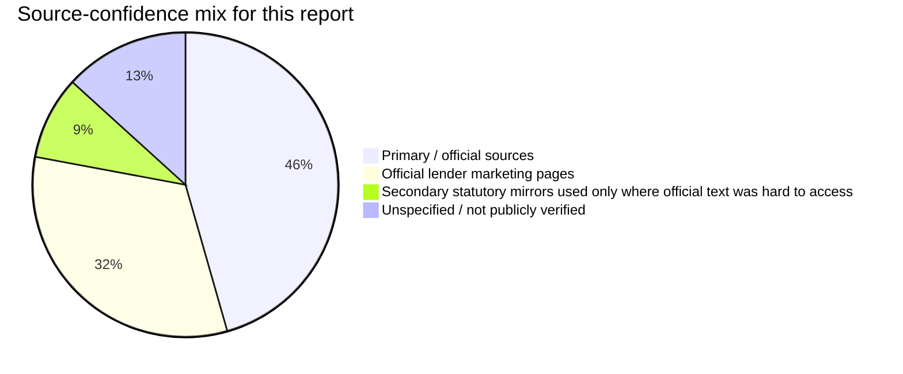
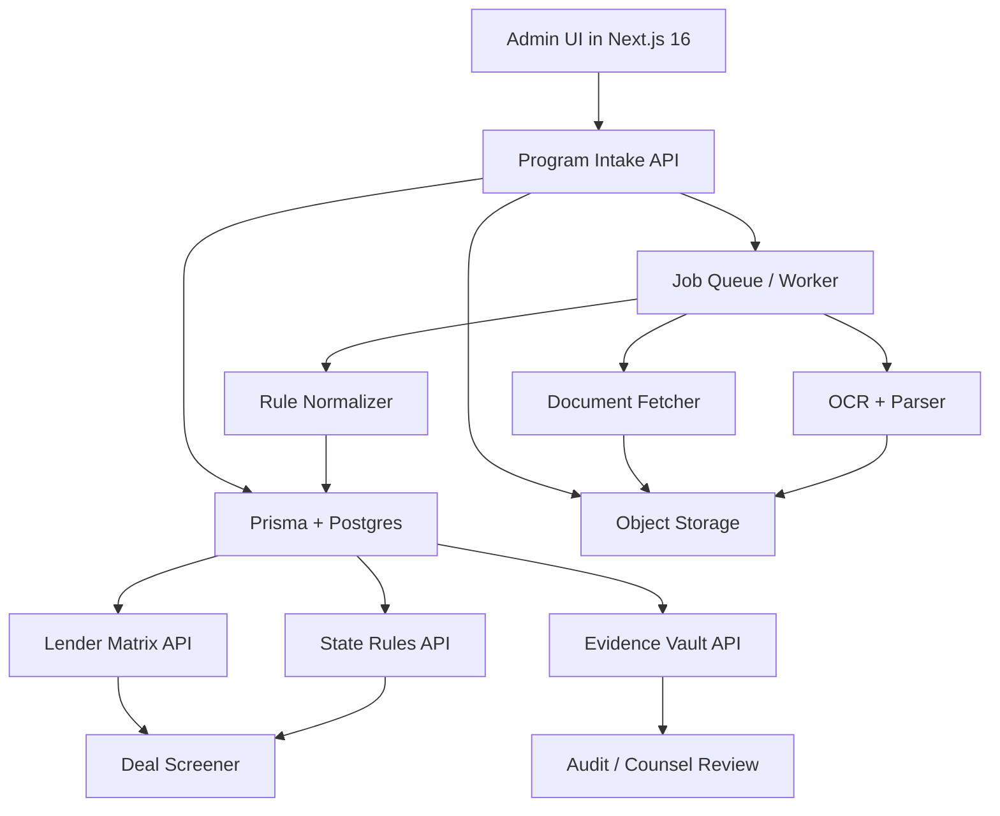
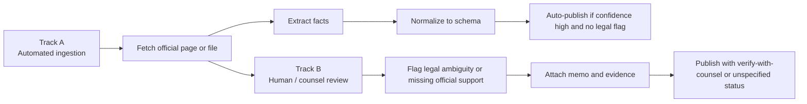

# UltraPlan Fact Check and Step-by-Step Implementation UltraPlan

## Executive summary

The UltraPlan is directionally strong on product strategy, but several of its highest-risk claims need revision before you operationalize them. The strongest, most production-ready findings are these: many of the targeted DSCR lenders do publicly confirm investor-focused underwriting based on property cash flow rather than personal income; several publish headline facts such as minimum FICO, maximum LTV, minimum DSCR, and “rates starting at” pricing; Pennsylvania and Ohio both use indexed dollar thresholds relevant to residential prepayment-penalty restrictions; Illinois, Washington, Minnesota, and New Jersey each have important residential-loan prepayment rules, but simplistic “LLC/corp = allowed” rules are not supported by the primary state sources I could verify; RESPA Section 8’s referral-fee ban applies only to settlement services involving a **federally related mortgage loan**, and Regulation X expressly exempts credit primarily for business, commercial, or agricultural purposes; ECOA and Regulation B do apply to business credit, but the adverse-action notice process for business applicants differs from consumer credit; and the proposed web stack is feasible if you treat Next.js as the application surface and move durable or long-running jobs into scheduled or worker-backed execution rather than into request threads. citeturn25search2turn24search3turn23search5turn30search0turn30search3turn30search1turn18search0turn19search0turn22search6turn22search0turn15search0turn16search0turn17search0

The biggest factual problems are lender completeness, state-law overgeneralization, and one lender identity issue. Public facts are **not** complete for all 14 lenders on all requested attributes; Velocity’s detailed rate sheet is gated to licensed mortgage professionals, so several program specifics remain public-site “unspecified.” Anchor Six could not be validated as a mortgage lender from official/public lending sources; the domain surfaced was an IT services company, which strongly suggests that this entry should be replaced or verified manually before any build proceeds. AirDNA’s API documentation is public, but its enterprise API pricing is not; access is by contacting sales. NMLS Consumer Access is public and free, but I did not find an official public API offering in the sources reviewed. citeturn11search1turn8search0turn28search0turn26search0turn26search36

Because the UltraPlan materials emphasize 14 lenders, PPP-state logic, DSCR factors, rent and flood data providers, Reg B / ECOA, RESPA / Reg Z, OCR, evidence storage, and a Next.js 16 + TypeScript + Prisma architecture, this report treats those as the governing workstreams for the production plan. Where the uploaded plan names more than 14 lenders overall, I treated the first 14 lenders listed in the lender appendix as the requested cohort for fact-checking: Griffin, Defy, Easy Street, Lima One, New Silver, Kiavi, Deephaven, Visio, LendingOne, RCN Capital, Anchor Loans, Velocity, Park Place Finance, and Anchor Six. fileciteturn0file0 fileciteturn0file1



## Scope and fact-check method

I prioritized primary or official sources in this order: lender-owned program pages and forms libraries; state statute or regulator pages; CFPB and eCFR / official regulatory text; FEMA official NFHL and MSC resources; official vendor API docs and pricing pages; and official framework documentation. I treated anything not clearly published by the lender, regulator, or platform owner as non-primary and used it only when official text was not easily surfaced in the available public interface. citeturn30search0turn30search1turn29search0turn26search0turn23search3turn25search2

For DSCR math, I used the standard fully amortizing mortgage formula and simple interest-only formula as engineering calculations rather than as sourced legal claims:

- **DSCR screen formula recommended for your 1–4 unit lender-matrix product**: `Gross Monthly Rent ÷ Monthly PITIA`
- **Fully amortizing payment**: `PMT = L × r / (1 − (1 + r)^−n)`, where `r = annual_rate / 12`
- **Payment factor per $1,000**: `1000 × r / (1 − (1 + r)^−n)`
- **Interest-only payment factor per $1,000**: `1000 × annual_rate / 12`

That DSCR rental-income-over-PITIA framing is explicitly reflected on Griffin, Easy Street, Kiavi, Lima One, and Visio pages, which is why I recommend it as the production default for your lender-comparison engine. citeturn0search0turn1search2turn13search1turn2search1turn6search7

The table below captures the highest-load-bearing claims from the UltraPlan that were directly verified or materially revised.

| Claim cluster | Verified finding | Primary URL | Effective / current date | Confidence | Production action |
|---|---|---|---|---:|---|
| ECOA / Reg B applies to business credit | **Keep with nuance.** ECOA protects both individuals and businesses seeking credit; Reg B notification rules expressly include special handling for business credit applicants. citeturn23search3turn24search3 | `https://www.consumerfinance.gov/compliance/compliance-resources/other-applicable-requirements/equal-credit-opportunity-act/` and `https://www.law.cornell.edu/cfr/text/12/1002.9` | CFPB page current as crawled; CFR page current text | 0.97 | Keep |
| Adverse action notices are still required when using AI / opaque models | **Keep.** CFPB says creditors must still provide specific and accurate reasons and cannot evade ECOA by using “black-box” models. citeturn23search5turn23search2 | `https://www.consumerfinance.gov/compliance/circulars/circular-2022-03-adverse-action-notification-requirements-in-connection-with-credit-decisions-based-on-complex-algorithms/` | Circular 2022-03; reaffirmed in later CFPB guidance | 0.98 | Keep |
| RESPA referral-fee ban applies to business-purpose loans | **Revise.** Regulation X exempts credit primarily for business, commercial, or agricultural purpose from RESPA coverage. Section 8 still applies for covered federally related mortgage loans. citeturn25search2turn24search2 | `https://www.law.cornell.edu/cfr/text/12/1024.5` and `https://www.law.cornell.edu/cfr/text/12/1024.14` | Current eCFR text as crawled | 0.98 | Revise |
| Reg Z business-purpose exemption exists | **Keep.** Regulation Z excludes credit primarily for business, commercial, agricultural, or organizational purposes. citeturn24search4 | `https://ecfr.io/Title-12/Section-1026.3` | Current text as crawled | 0.96 | Keep |
| Ohio PPP rule is a simple blanket “allowed / banned” rule | **Revise.** Ohio Rev. Code 1343.011 sets restrictions for “residential mortgage” loans on 1–2 unit property; penalties are capped and small-loan thresholds matter. citeturn19search0 | `https://codes.ohio.gov/ohio-revised-code/section-1343.011` | Effective Dec. 28, 2009; annual indexed threshold applies | 0.92 | Revise |
| Pennsylvania PPP threshold should be hard-coded without annual refresh | **Replace with index-driven logic.** Pennsylvania publishes the annual Act 6 base figure; 2026 base figure is $329,411. citeturn18search0 | `https://www.pa.gov/agencies/dobs/media-resources/act-6-information` | 2026 page | 0.98 | Replace |
| New Jersey PPP can be inferred solely from vesting in LLC/corp | **Verify with counsel.** NJ’s general statute says mortgage loans may be prepaid without penalty, but DOBI notes important product/lender exceptions and historical federal preemption issues; primary public sources reviewed do **not** support a clean LLC-vs-corp rule. citeturn17search0turn16search0 | `https://law.justia.com/codes/new-jersey/title-46/section-46-10b-2/` and `https://www.nj.gov/dobi/division_consumers/finance/bankfaqs.htm` | Current statute page; DOBI FAQ current as crawled | 0.78 | Verify-with-counsel |
| Illinois PPP can be reduced to entity form only | **Verify with counsel.** Official Illinois statute reviewed governs residential mortgage loans and caps penalties with borrower disclosure; it does not state the simple entity-only shortcut often used in non-QM overlays. citeturn22search6 | `https://ilga.gov/documents/legislation/ilcs/documents/020506350K5-8.htm` | Effective on and after Jan. 10, 2014 per statute note | 0.85 | Verify-with-counsel |
| Washington PPP bans all prepay penalties | **Revise.** Official RCW limits residential ARM penalties beyond 60 days prior to initial reset; it is not a blanket all-loan prohibition in the source reviewed. citeturn22search0turn22search7 | `https://app.leg.wa.gov/rcw/default.aspx?cite=19.144.040` | Current RCW / WAC text as crawled | 0.93 | Revise |
| Minnesota PPP is unrestricted for business-purpose DSCR | **Verify with counsel.** Official Minnesota mortgage-originator statute imposes residential-loan prepayment restrictions; whether your contemplated DSCR usage falls outside that consumer/residential perimeter is a legal classification question, not a safe engineering assumption. citeturn15search0turn15search2 | `https://www.revisor.mn.gov/statutes/?id=58.137&year=2005` and `https://www.revisor.mn.gov/statutes/cite/58` | Current chapter page; section text as surfaced | 0.80 | Verify-with-counsel |
| AirDNA API pricing is a fixed public self-serve price | **Replace.** AirDNA’s API docs are public and bearer-token based, but pricing is enterprise / contact-sales, not a public self-serve API price sheet. citeturn28search0turn28search2 | `https://docs.airdna.co/` | Current docs as crawled | 0.97 | Replace |
| NMLS has a free public consumer-access website | **Keep.** Consumer Access is public and free. citeturn26search0turn26search36 | `https://mortgage.nationwidelicensingsystem.org/about/Pages/NMLSConsumerAccess.aspx` | Published Nov. 7, 2025; current as crawled | 0.98 | Keep |
| NMLS has an official public API suitable for production automation | **Unspecified.** I did not find an official public API in the reviewed official sources. citeturn26search0turn26search36 | `https://mortgage.nationwidelicensingsystem.org/about/Pages/NMLSConsumerAccess.aspx` | Current as crawled | 0.72 | Replace with manual / browser workflow until vendor-confirmed |
| Next.js 16 + TypeScript + Prisma is feasible | **Keep.** Next.js 16 is current and Prisma supports mainstream SQL databases including PostgreSQL. citeturn30search0turn30search1 | `https://nextjs.org/blog/next-16` and `https://www.prisma.io/docs/orm/reference/supported-databases` | Next.js 16 released Oct. 21, 2025; Prisma docs current as crawled | 0.97 | Keep |
| Next.js alone is enough for durable background processing | **Revise.** Vercel supports cron-triggered functions, but durable background orchestration should be separated from request/response paths. citeturn30search3turn30search0 | `https://vercel.com/docs/cron-jobs` | Vercel doc updated Jun. 25, 2025 | 0.91 | Revise |

## Lender program fact-check

Public lender pages do support a meaningful first-release comparison product, but not a “fully specified” production truth set for every lender and attribute. The right implementation is: use official public pages as the **bootstrap source**, then add a gated evidence-vault object per lender / program / state / effective date so that missing items stay explicitly “unspecified” until your operations team uploads current matrices or rate sheets. That is especially important for pricing, which is often shown only as “rates starting at” on public pages or hidden behind broker portals. citeturn11search1turn13search1turn3search0turn9search0

### Lender comparison table

| Lender | Publicly verified LTV | Publicly verified min FICO | Publicly verified min DSCR | Publicly visible doc stack | Public pricing visibility | Effective / current date | Confidence | Action |
|---|---|---|---|---|---|---|---:|---|
| Griffin Funding | Up to 85% max LTV; no-ratio option up to 75% LTV. citeturn0search0turn0search4 | 620. citeturn0search0 | 0.75 on standard text; no-ratio option exists. citeturn0search0turn0search4 | No tax returns / W-2s; appraisal required for value and rental-income verification. citeturn0search0 | Fixed 6.125%–7.5%; ARM 5.125%–6.125% on cited page. citeturn0search4 | May–Jun. 2026 page updates | 0.93 | Keep |
| Defy Mortgage | Public rate page gives pricing bands by FICO/LTV, but full matrix not fully surfaced in reviewed sources. citeturn5search2 | 640. citeturn5search2 | Unspecified on official page reviewed. | No income verification / no tax returns / no pay stubs. citeturn5search2 | 6.125% at 740+ / 75% LTV; 7.875% at 640 / 75% LTV on cited rate page. citeturn5search2 | Published last week | 0.79 | Keep, but add manual matrix ingest |
| Easy Street Capital | Up to 80% purchase / rate-term; 75% cash-out. citeturn1search3turn1search4 | 640 on product page; FAQ references median minimum 620. Treat 640 as current product standard. citeturn1search3turn1search2 | Product page says no minimum DSCR; FAQ cites 1.20x for 5+ property single-loan scenario. citeturn1search3turn1search2 | Purchase docs not fully itemized publicly. | Rates starting at 5.75%; 0–3% closing fee; underwriting and processing fees listed. citeturn1search4 | Page crawled Jun. 2026 | 0.90 | Keep with scenario-specific DSCR logic |
| Lima One | Single-rental and portfolio pages imply leverage tied to DSCR; public launch page shows Rental30 Premier up to 80% on portfolios. citeturn2search3turn2search6 | Adequate credit required, specific min FICO not public in reviewed pages. | Minimum 1.0; 1.2+ gets best rate / leverage. citeturn2search0turn2search3 | Refi docs: current leases, rent verification, property-management docs; purchase: purchase agreement. citeturn2search3 | “Increase cash flow” and customizable buy-down / PPP pricing, but no public rate sheet. citeturn2search0 | Page crawled Jun. 2026 | 0.88 | Keep; mark min FICO unspecified |
| New Silver | Up to 80% loan-to-purchase price / LTV. citeturn4search0 | 660. citeturn4search0 | 0.75 stated on main page. Some state pages contain contradictory copy; use main DSCR page until reconciled. citeturn4search0turn4search2 | No personal-income-doc requirement publicly stated. citeturn4search8 | Interest rate from 6%; origination 0–1.5%. citeturn4search0 | Published Mar. 2026 / crawled Jun. 2026 | 0.90 | Keep, but flag contradictory state-page copy |
| Kiavi | Up to 80% LTV. citeturn13search0turn13search7 | FICO affects leverage; specific public floor not surfaced in reviewed pages. | Minimum 1.1 to prequalify. citeturn13search1 | Soft credit pull at prequal, appraisal fee at application, title/insurance/appraisal ordered in processing. citeturn13search1 | Rates as low as 5.75% or 6% depending on page / partner page. citeturn13search0turn13search7 | Current pages crawled Jun. 2026 | 0.89 | Keep; mark min FICO unspecified |
| Deephaven | Up to 80% purchase/rate-term; 75% cash-out. citeturn1search5 | 640. citeturn1search5 | “Low or no DSCR ratio.” Exact floor unspecified. citeturn1search5 | Traditional income verification not required. citeturn1search5 | No public rate sheet in reviewed page. | Published 11 months ago; crawled last week | 0.86 | Keep, but mark pricing and exact DSCR floor unspecified |
| Visio Lending | Public reviewed pages validate DSCR methodology and market positioning, but not a full current public underwriting matrix. citeturn6search8turn6search7 | Unspecified in reviewed official pages. | Calculator framing shows 0.75–0.99 acceptable, 1.0–1.19 good, 1.2+ exceptional. citeturn6search7 | Public pages reviewed do not itemize doc stack. | No clear public “rates starting at” page captured in reviewed sources. | Current pages crawled Jun. 2026 | 0.74 | Keep brand, but require matrix upload before automation |
| LendingOne | Up to 80% purchase/rate-term; 75% cash-out. citeturn3search0turn3search2 | Unspecified on reviewed official pages. | As low as 0.75 DSCR. citeturn3search0 | No W-2s / tax returns; business-purpose loan under LLC; 90-day seasoning for cash-out. citeturn3search0 | No public rate sheet, but “point buy-downs available.” citeturn3search1turn3search8 | Current pages crawled Jun. 2026 | 0.91 | Keep |
| RCN Capital | Up to 80% purchase/refi; 75% cash-out. citeturn9search0 | 660 for long-term rental. citeturn9search0 | 1.00. citeturn9search0turn9search4 | Public FAQs / guidelines exist; no full public checklist in reviewed pages. | Rates starting at 5.25%. citeturn9search0 | Current pages crawled Jun. 2026 | 0.96 | Keep |
| Anchor Loans | Public site confirms DSCR rental financing exists and all loans are business-purpose, but detailed public DSCR matrix not surfaced. citeturn6search0turn6search2 | Unspecified | Unspecified | Unspecified | Unspecified | Current pages crawled Jun. 2026 | 0.67 | Keep brand only; require direct matrix ingest |
| Velocity Mortgage Capital | Public site confirms long-term investor programs, 30-year fixed FlexTerm, interest-only options, and broker-only distribution; detailed program brochure/rate sheet is gated. citeturn10search1turn12view0 | Unspecified publicly | Unspecified publicly | Residential forms library, title request, insurance checklist, entity checklist exist. citeturn12view0 | “Par pricing, rebates available” but no public rate sheet. citeturn10search1 | Current pages crawled Jun. 2026 | 0.76 | Keep; do not auto-publish specifics without gated docs |
| Park Place Finance | Up to 85% purchase; 75% cash-out. citeturn7search1 | 660. citeturn7search1 | As low as 0.75. citeturn7search1 | Purchase contract, REO schedule, insurance, ID, last 2 bank statements, lease, entity docs, payoff if refi. citeturn7search1 | Rates starting at 5.75%; 0–4 discount points. citeturn7search1 | Page crawled Jun. 2026 | 0.95 | Keep |
| Anchor Six | I could not verify a mortgage lender matching this name from the sources reviewed; surfaced domain was an IT services firm, not a lender. citeturn8search0turn8search1 | Unspecified | Unspecified | Unspecified | Unspecified | Current pages crawled Jun. 2026 | 0.20 | Replace or verify manually before build |

### Lender discrepancy list with remediation

The main discrepancy is **false precision**. Your UltraPlan should not pretend to know min FICO, DSCR floor, or pricing when the lender’s public site does not currently expose that fact. For Visio, Anchor, Velocity, and possibly Kiavi on min-FICO detail, the right production state is **unspecified until evidence uploaded**. That avoids silent legal and pricing drift. citeturn6search8turn6search7turn6search0turn10search1turn12view0turn13search1

The second discrepancy is **scenario collapse**. Easy Street’s public pages show “no minimum DSCR” on the flagship product page, but a separate FAQ shows 1.20x for a specific multi-property-in-one-loan scenario. That means your rules engine needs a `program_variant` and `property_count_in_note` dimension instead of a single scalar `min_dscr` field. citeturn1search3turn1search2

The third discrepancy is **identity quality control**. Anchor Six is not production-safe until you verify the intended target with an NMLS ID, lender legal name, and current licensing footprint. Do not build around that name as-is. citeturn8search0turn26search0

## State PPP rules, DSCR bands, and compliance conclusions

### State PPP rules

The table below is written narrowly: it captures what the **official or closest-available primary sources reviewed actually support**, not what secondary lender overlays often claim.

| State | Primary-source rule verified | Primary URL | Effective / current date | Confidence | Production action |
|---|---|---|---|---:|---|
| Ohio | For “residential mortgage” loans on 1–2 unit residential real estate, PPP may not exceed 1% of original principal and cannot run beyond five years; subdivision (C)(2)(a) bars PPPs on smaller qualifying loans, with the threshold indexed annually. 2026 threshold should be treated as **indexed / annually refreshed**, not hard-coded forever. citeturn19search0turn21search3 | `https://codes.ohio.gov/ohio-revised-code/section-1343.011` | Statute effective Dec. 28, 2009; threshold adjusts annually | 0.91 | Keep with annual threshold config |
| Pennsylvania | Pennsylvania publishes the **2026 Act 6 Base Figure = $329,411**. Use this as the annually refreshed threshold in your rules engine for the residential mortgage logic your plan is targeting. citeturn18search0 | `https://www.pa.gov/agencies/dobs/media-resources/act-6-information` | 2026 | 0.98 | Keep with annual refresh job |
| Illinois | Residential-mortgage PPP allowed only if borrower is offered a no-PPP alternative in writing and declines it; PPP capped at 3 years or first ARM change date, with 3% / 2% / 1% annual cap schedule; prohibited on sale or destruction of dwelling. citeturn22search6 | `https://ilga.gov/documents/legislation/ilcs/documents/020506350K5-8.htm` | Applies to covered loans made / modified on or after Jan. 10, 2014 | 0.95 | Keep for consumer/residential path; verify DSCR entity overlays with counsel |
| Washington | Residential ARM PPP may not extend beyond 60 days before initial reset; WAC reviewed also states no PPP unless on an ARM and expiring at least 60 days before initial reset for covered loans. citeturn22search0turn22search7 | `https://app.leg.wa.gov/rcw/default.aspx?cite=19.144.040` | Current as crawled | 0.93 | Keep for residential ARM path |
| Minnesota | Residential mortgage originator may not charge PPP on partial prepayments, on sale, after 42 months, or above lesser of 2% UPB or 60 days’ interest on covered residential mortgage loans. Consumer/residential classification matters. citeturn15search0turn15search2 | `https://www.revisor.mn.gov/statutes/?id=58.137&year=2005` | Current chapter page / section surfaced | 0.85 | Verify-with-counsel before DSCR automation |
| New Jersey | General NJ statute says mortgage loans may be prepaid at any time without penalty, but DOBI notes certain product/lender exceptions and historical preemption context. Do not code a simplistic entity-rule without counsel. citeturn17search0turn16search0 | `https://law.justia.com/codes/new-jersey/title-46/section-46-10b-2/` and `https://www.nj.gov/dobi/division_consumers/finance/bankfaqs.htm` | Current as crawled | 0.78 | Verify-with-counsel |
| All other states | Per your instruction, mark as **unspecified** in the initial release. | — | — | 1.00 | Keep as unspecified |

### DSCR rate bands and payment-factor math

The most reliable product decision is to separate **screening bands** from **lender truth**.

For screening, use these standard DSCR bands:

| DSCR band | Meaning | Recommended UI / workflow action |
|---|---|---|
| `< 0.75` | Fails most public non-QM DSCR pages reviewed unless a special “no-ratio” or exception program exists. citeturn0search0turn4search0turn7search1 | Show red; allow exception only where evidence-vault has lender-specific no-ratio rule |
| `0.75 – 0.99` | Borderline but publicly accepted by several lenders / calculators. citeturn0search0turn4search0turn6search7turn3search0 | Show amber; price / leverage penalties likely |
| `1.00 – 1.19` | Common pass band; Lima One minimum 1.0 and Kiavi prequal 1.1 align here. citeturn2search0turn2search3turn13search1 | Show green; medium leverage |
| `1.20+` | Often best execution band on public pages. citeturn2search3turn6search7turn3search8 | Show dark green; best pricing / leverage candidate |

For payment factors, use the following engineering golden tests for a **30-year fully amortizing loan**:

| Note rate | Monthly PI factor per $1,000 | Golden test |
|---|---:|---|
| 6.00% | 5.9955 | $300,000 loan → about $1,798.65 PI |
| 6.50% | 6.3207 | $300,000 loan → about $1,896.21 PI |
| 7.00% | 6.6530 | $300,000 loan → about $1,995.90 PI |
| 7.50% | 6.9922 | $300,000 loan → about $2,097.66 PI |
| 8.00% | 7.3378 | $300,000 loan → about $2,201.34 PI |

For **interest-only** screening, the monthly factor per $1,000 is simply:

| Note rate | IO factor per $1,000 | Golden test |
|---|---:|---|
| 6.00% | 5.0000 | $300,000 loan → $1,500.00 |
| 6.50% | 5.4167 | $300,000 loan → $1,625.00 |
| 7.00% | 5.8333 | $300,000 loan → $1,750.00 |
| 7.50% | 6.2500 | $300,000 loan → $1,875.00 |
| 8.00% | 6.6667 | $300,000 loan → $2,000.00 |

The production implication is simple: calculate `PI`, then derive `PITIA`, then compute `DSCR = rent / PITIA`. If a lender’s evidence object states “qualify using IO payment,” swap the amortizing factor for the IO factor **only for that lender/program/version**, not globally. That approach fits public statements from Griffin, LendingOne, Park Place, and Deephaven that some lower-DSCR or IO structures are available. citeturn0search0turn3search0turn7search1turn1search5

### Data-source API table

| Source | What it can credibly support | Example official endpoints / access path | Auth | Public cost / pricing | Rate limits | Confidence | Production action |
|---|---|---|---|---|---|---:|---|
| RentCast | Property records, AVMs, rent estimates, comps, listings, market trends. citeturn27search1 | Property-data API and endpoint docs on product page. | API key / dashboard-managed. citeturn27search1 | Starts with 50 free API calls per month; public plan pricing available. citeturn27search1 | Public page reviewed did not enumerate hard request-per-second cap. | 0.95 | Use for baseline property + rent estimate layer |
| Rentometer | Rent estimate, percentile rents, nearby comps, PDF reports. citeturn27search2 | QuickView, Pro Report, Nearby Rent Comps API. | Included with Pro subscription. citeturn27search2 | Pro subscription plus credit packs; pricing public. citeturn27search2 | Reviewed pricing page did not state hard RPM limit. | 0.93 | Use as secondary corroboration source |
| AirDNA | STR market data, comps, rentalizer, smart rates. citeturn28search0 | Enterprise API docs include market search, listing comps, rentalizer, smart rates. | Bearer token. citeturn28search0 | API pricing not public; contact sales. Platform subscription pricing is public, but that is not the same as API pricing. citeturn28search0turn28search1 | Docs reviewed did not state public per-plan rate limit. | 0.94 | Use only after enterprise quote; do not hardcode API COGS |
| FEMA NFHL | Flood hazard mapping, official flood layer lookup. citeturn29search4turn29search0 | FEMA WMS / MSC / NFHL web services. citeturn29search1turn29search6 | Public access; no auth surfaced on reviewed public WMS resources. | Free public federal resource. citeturn29search0turn29search1 | No public rate limit surfaced in reviewed pages. | 0.95 | Use for official flood flagging |
| NMLS Consumer Access | License / registration verification for companies and MLOs. citeturn26search0turn26search2 | NMLS Consumer Access public search site. | Public website access. | Free to public. citeturn26search0 | No public API / rate-limit documentation found in reviewed official sources. | 0.88 | Use via browser/manual verification unless vendor-confirmed API source exists |

## Architecture, OCR, and evidence-vault design

The stack is feasible, but only if you separate **system of record**, **evidence**, and **computation** cleanly. Next.js 16 is appropriate for the user-facing application, typed server actions, admin review flows, and report rendering. Prisma is appropriate for relational modeling on PostgreSQL. Vercel Cron can handle simple recurring refreshes, but durable crawler / OCR / evidence-normalization work should run as queue-backed jobs instead of as synchronous web requests. citeturn30search0turn30search1turn30search3

### Recommended component diagram



The OCR layer should be **evidence-preserving**, not “data-overwriting.” In practice that means every extracted fact needs these fields at minimum: `claim_text`, `normalized_field`, `raw_value`, `normalized_value`, `source_url`, `source_type`, `retrieved_at`, `effective_date`, `jurisdiction`, `program_name`, `confidence`, `human_review_status`, `supersedes_evidence_id`, and a checksum or immutable object-storage pointer for the source artifact. That design lets you show exactly why a rule exists and when it must be refreshed. This is especially important for lenders with moving rate floors and for statutes with annual indexed thresholds. citeturn18search0turn19search0turn11search1

### Track A and Track B flow



Track A should be limited to high-confidence content with strong official support: lender headline LTV/FICO/DSCR/rates-from values, Pennsylvania Act 6 base figure, Ohio indexed threshold, FEMA flood service status, NMLS free-access facts, and official product-framework facts. Track B should handle state-law ambiguity, lender overlays that depend on vesting or property count, and anything pulled from gated broker materials. citeturn18search0turn19search0turn26search0turn30search0turn30search1

### Sample Evidence Vault JSON schema

```json
{
  "evidence_id": "ev_2026_06_17_ohio_ppp_1343_011_v1",
  "entity_type": "state_rule",
  "entity_key": "OH_PPP_RESIDENTIAL_MORTGAGE",
  "jurisdiction": "OH",
  "program_name": null,
  "claim_text": "For qualifying Ohio 1-2 unit residential mortgages, prepayment penalties are restricted and small loans below the indexed threshold may not carry a penalty.",
  "normalized_field": "prepayment_penalty_rule",
  "raw_value": "ORC 1343.011(C)",
  "normalized_value": {
    "property_scope": "1-2 unit residential mortgage",
    "max_penalty_percent_original_principal": 1.0,
    "max_term_years": 5,
    "indexed_small_loan_threshold": {
      "value": 116356,
      "currency": "USD",
      "year": 2026,
      "refresh_required": true
    }
  },
  "source": {
    "source_type": "official_statute",
    "title": "Ohio Revised Code 1343.011",
    "url": "https://codes.ohio.gov/ohio-revised-code/section-1343.011",
    "publisher": "Ohio Laws",
    "retrieved_at": "2026-06-17T00:00:00Z",
    "effective_date": "2009-12-28"
  },
  "artifact": {
    "storage_uri": "s3://evidence/ohio/1343.011/2026-06-17/source.html",
    "sha256": "REPLACE_WITH_HASH",
    "content_type": "text/html"
  },
  "confidence": 0.91,
  "review": {
    "status": "approved",
    "reviewed_by": "ops_or_counsel_user_id",
    "reviewed_at": "2026-06-17T00:00:00Z",
    "notes": "Annual threshold must refresh each January."
  },
  "supersedes_evidence_id": null,
  "tags": ["ppp", "state-law", "residential-mortgage", "annual-threshold"]
}
```

## Step-by-step implementation UltraPlan

The sequence below is optimized for **shipping a defensible MVP quickly** while preventing the two failures that would hurt you most: incorrect legal logic and stale lender data.

### Phase one build the evidence-first core

In week one, create the canonical schema in PostgreSQL through Prisma. You need tables or models for `Lender`, `Program`, `JurisdictionRule`, `Evidence`, `Claim`, `Document`, `ExtractionRun`, `RefreshSchedule`, and `ReviewDecision`. Acceptance criteria: you can store one lender page, one statute, one API-provider page, and one manually entered counsel note with immutable evidence links and version history. Use PostgreSQL because Prisma supports it cleanly and because you need transactional integrity and queryable JSON fields for normalized evidence payloads. citeturn30search1

In week two, implement the Evidence Vault admin UI in Next.js 16. The UI should support manual entry first, file upload second, and URL-based capture third. Acceptance criteria: an operator can add Griffin Funding’s DSCR page, Ohio ORC 1343.011, and the Pennsylvania Act 6 page, tag them, normalize at least five facts from each, and mark each fact as `keep`, `revise`, `replace`, or `verify-with-counsel`. Next.js 16 is a fit here because it is current, TypeScript-friendly, and suitable for a controlled admin console. citeturn30search0

### Phase two ship a narrow, accurate lender-and-rule MVP

In weeks three and four, publish a lender matrix MVP for the lenders with the strongest public support: Griffin, Easy Street, Lima One, New Silver, Kiavi, Deephaven, LendingOne, RCN, and Park Place. For Visio, Anchor, and Velocity, publish only fields that are explicitly evidenced; leave the rest as `unspecified`. Remove Anchor Six from the public matrix unless you obtain a validated lender identity and NMLS-backed proof. Acceptance criteria: every visible public field links to at least one evidence record and no unsupported field is shown as a concrete number. citeturn0search0turn1search3turn2search3turn4search0turn13search1turn1search5turn3search0turn9search0turn7search1turn8search0turn26search0

In parallel, build the state PPP rules engine for only the six requested states plus `unspecified` for all others. Acceptance criteria: rules output returns `allowed`, `restricted`, `prohibited`, or `verify_with_counsel`, with a human-readable rationale and evidence pointers. In the first release, Pennsylvania and Ohio must support annual refresh fields; Illinois and Washington must support product-type nuance; Minnesota and New Jersey must surface a counsel-warning banner. citeturn18search0turn19search0turn22search6turn22search0turn15search0turn16search0turn17search0

### Phase three harden the math and data-provider layer

In week five, implement the DSCR calculator as a pure library with unit tests against the golden values listed above. Acceptance criteria: exact match to four decimal places on payment factors and stable pass/fail banding for the same input payload. Use lender-specific switches for amortizing versus IO qualification and for program variants like Easy Street’s portfolio scenario. The laws and lender pages support DSCR as a core underwriting measure, but the actual math is your own engineering implementation and therefore should be test-driven. citeturn0search0turn1search2turn13search1turn2search1turn6search7

In weeks six and seven, integrate data providers in a ranked fallback order: RentCast first for broad property and rent coverage, Rentometer second for rent corroboration, FEMA NFHL for flood hazard screening, NMLS Consumer Access as browser-based validation, and AirDNA only after the enterprise commercial decision is signed. Acceptance criteria: every external lookup stores the request parameters, raw response or screenshot pointer, and normalization outcome in the vault. Do **not** ship an AirDNA-dependent feature before you have pricing approval and enterprise credentials. citeturn27search1turn27search2turn29search0turn29search1turn26search0turn28search0

### Phase four add compliance guardrails before scale

In week eight, implement a compliance classifier with three states: `consumer/residential covered`, `business-purpose likely exempt from RESPA`, and `legal review required`. The classifier should not make final legal decisions on edge cases; it should simply prevent unsafe automation. Acceptance criteria: if a deal is coded as owner-occupied or consumer-purpose, the app blocks business-purpose referral-fee assumptions and requires consumer adverse-action workflows. If a deal is coded as business-purpose, the app still preserves ECOA / fair-lending review and reason-code generation. citeturn25search2turn24search2turn24search3turn23search5

In week nine, add scheduled refreshes. Use Vercel Cron only for lightweight refresh triggers and health checks; hand off actual refresh work to a worker or queue. Acceptance criteria: the system refreshes Pennsylvania’s Act 6 base figure, reviews Ohio threshold evidence, and flags stale lender pages every month without blocking user traffic. citeturn30search3turn30search0

In week ten, run a formal evidence audit. Acceptance criteria: for a sample of 50 public claims, 100% are traceable to evidence; 0 unsupported claims remain published; all legal-ambiguity states are visibly labeled; and every lender page shows an “as of” date.

## Open questions and limitations

Several requested items remain **unspecified** because the strongest available public sources do not expose them cleanly. The main gaps are: complete public pricing matrices for some lenders, exact current minimum FICO for Kiavi and Visio from official pages reviewed, exact detailed DSCR rental matrix for Anchor Loans and Velocity from public pages, and the intended identity of “Anchor Six.” Those are not safe places to invent precision. citeturn13search1turn6search8turn6search0turn12view0turn8search0

The state PPP area is the most legally sensitive part of the UltraPlan. Your original concept can be made operational, but only if you stop encoding folk-rules like “LLC means business-purpose so PPP is okay” unless counsel has approved that exact state-and-product interpretation. The primary sources reviewed support a more conservative implementation: model the **covered residential rule**, then allow a `verify_with_counsel` override path where business-purpose classification is expected to alter treatment. citeturn25search2turn24search4turn22search6turn17search0turn15search0