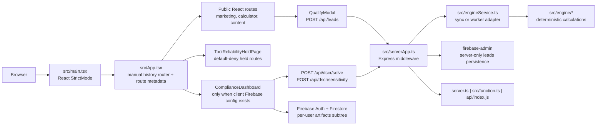

# GreenStreet Architecture Wave Baseline

Status: documentation-only baseline, 2026-07-28

Scope: route resolution, frontend, server, deterministic calculation, persistence, deployment adapters, and regression seams in the current isolated worktree.

Change authority: none. This document records the current implementation and identifies future seams; it does not authorize a refactor, release of a held tool, change to an assumption, or removal of a reliability hold.

## 1. Preservation rule

The working product is the baseline. Any future architecture work must preserve all currently working routes, public calculator behavior, lead intake behavior, authentication behavior, current reliability holds, metadata/noindex behavior, homepage composition, and deployment entry points unless a separately approved ticket explicitly changes one of them.

Before any code change, capture the affected behavior, make the smallest change, run the relevant regression matrix in section 8, and retain a rollback artifact. A failed baseline stops the change; it is not permission to expand the task.

## 2. Current topology

The diagram describes runtime flow, not release approval. In particular, availability of code is separate from authorization to publish a financial, pricing, program, legal, tax, or recommendation output.

## 3. Route and rendering map

### 3.1 Route resolution seam

`src/router/resolve.ts` maps URL paths to the `PageView` union. `src/App.tsx` turns a `PageView` into a React render path and owns browser-history handling, global internal-link interception, scroll reset, body classes, route metadata application, and idle prefetching. `src/seo/routeMetadata.ts` assigns public metadata or `noindex,nofollow` metadata from the resolved view and pathname.

There is no framework router. The current interface is distributed across:

- `ROUTE_MAP`, `resolveRoute`, and `isKnownRoute` in `src/router/resolve.ts`;
- `viewToPath`, `portalTabFromPath`, and `RELIABILITY_HOLD_VIEWS` in `src/App.tsx`;
- public-page, legal-alias, blog-slug, and held-view records in `src/seo/routeMetadata.ts`;
- `public/sitemap.xml` and `public/robots.txt`.

This is a real route seam because the same URL meaning has more than one consumer: rendering, click interception, canonical metadata, search discovery, and legacy aliases.

| Route group | Current behavior | Principal implementation | Required preservation |
| --- | --- | --- | --- |
| `/` | Renders the legacy-markup marketing home through a React portal. | `MarketingHome.tsx` | Keep content sanitization, semantics repairs, external booking behavior, and homepage contract valid. |
| `/dscr-calculator` | Public educational LTR calculation rendered entirely in the browser. | `DSCRCalculatorPage.tsx`, `publicDealAnalysis.ts` | Keep output labels, inputs, arithmetic, and navigation stable unless an approved model change says otherwise. |
| Public content and audience routes | Lazy-loaded public React pages. | `App.tsx` route importers and `src/pages/*` | Preserve direct navigation, browser back/forward, aliases, and canonical metadata. |
| Blog/case-study dynamic paths | Route resolver chooses a content renderer; metadata only indexes recognized article slugs. | `resolve.ts`, `BlogPostPage.tsx`, `routeMetadata.ts` | Unknown pages must remain a not-found/noindex result. |
| `/investgo` and selected subpaths | Renders the workspace only when four client Firebase environment values exist; otherwise a workspace reliability hold. | `App.tsx`, `ComplianceDashboard.tsx` | A missing or incomplete configuration must continue to fail closed. |
| Held decision routes | Render an availability page and receive noindex metadata. | `App.tsx`, `toolReliabilityHolds.ts`, `ToolReliabilityHoldPage.tsx` | Do not render the underlying decision module or publish a decision output. |
| Unknown/external URLs | Unknown internal paths render not-found; absolute external URLs resolve to the external handoff view. | `resolve.ts`, `App.tsx` | Do not silently send unknown paths to the marketing homepage. |

### 3.2 Held-tool contract

`src/components/toolReliabilityHolds.ts` is the public hold-content record. `App.tsx` separately keeps the set of held `PageView` values, while `src/routes/dscr.ts` separately returns `503 TOOL_RELIABILITY_HOLD` for the optimizer and state endpoints. `routeMetadata.ts` and `public/sitemap.xml` keep held paths out of search.

Current public availability is therefore an intersection of multiple modules, not one isolated switch. This is intentional protection, and any consolidation must be additive and default-deny until route, API, metadata, and sitemap tests prove equivalence.

## 4. Frontend modules and seams

### 4.1 Application shell

- `src/main.tsx` registers GSAP/ScrollTrigger and mounts `App` in React `StrictMode`.
- `src/App.tsx` lazy-loads major public pages. It also warms every public route importer after the first paint using `requestIdleCallback` or a timeout.
- `src/design/*`, `src/theme.ts`, and `src/index.css` provide the design primitives used by public pages and tool-hold pages.

The `routeModules` importer record is a useful existing module: one list supplies both `React.lazy` and idle prefetch. Its depth comes from hiding the import mechanics behind a small caller surface. The performance tradeoff is material, however: warm-all-routes deliberately downloads and parses route chunks that a visitor may never open. The current built assets include a roughly 319 KB `ComplianceDashboard` route chunk and a roughly 524 KB Firebase chunk before compression. Keep the behavior until a measured performance ticket has browser evidence; do not replace it based on intuition.

### 4.2 Marketing home integration

`src/marketing/MarketingHome.tsx` is an adapter around the imported raw `home-markup.html` export. It:

1. replaces unsupported claims with safe copy;
2. replaces the rate and state decision widgets with availability holds;
3. repairs landmarks, controls, disabled forms, duplicate IDs, and mobile-menu keyboard behavior;
4. injects the resulting HTML into `#marketing-root` using `dangerouslySetInnerHTML`;
5. re-executes embedded scripts and starts/stops the Webflow/GSAP runtime on mount/unmount.

The homepage is protected by both `src/marketing/MarketingHome.test.ts` and the raw-markup SHA-256 contract checked by `scripts/check-home-contract.mjs`. The latter deliberately protects the source export, not every output of the string transformation or every browser interaction. Therefore no change to the raw markup, replacement list, script lifecycle, or portal hosts is safe without the fidelity check plus browser-level coverage.

### 4.3 Public calculator and lead intake

- `DSCRCalculatorPage.tsx` uses `src/engine/publicDealAnalysis.ts` directly in the browser for educational LTR arithmetic.
- `QualifyWidget.tsx` and `QualifyModal.tsx` use `qualify()` and state-law data for an estimate flow, then POST a deliberately narrow payload to `/api/leads`.
- The lead client must not persist directly to the `leads` collection and must not pass a financial-result snapshot to the server.

The public calculator and qualification modal use different calculation modules and different default assumptions. This is not evidence of a defect by itself: they answer different product questions. It is a high-risk coupling point because a future shared change can silently change one surface but not the other.

### 4.4 Workspace

`ComplianceDashboard.tsx` currently concentrates authentication UI, Firestore artifact persistence, dashboard display, manual input conversion, calls to the DSCR routes, history/settings UI, and the internal tab renderer in one approximately 102 KB source module.

The dashboard directly imports several advanced decision modules (`RefiTrackerPage`, `ARMPage`, `MonteCarloPage`, `ReturnsPage`, `TaxEnginePage`, `StressMatrixPage`, `DecisionSupportPage`, `STRUnderwritingPage`, and `PortfolioPage`). The visible sidebar deliberately omits these tools while they are held, and the URL-to-tab mapper only reaches the approved workspace tabs. That is a current safety control, but it is fragile coupling: a future tab entry or `initialTab` change could make held content reachable, while the direct imports already place it in the workspace route chunk.

## 5. Server, engine, and data seams

### 5.1 Server entry adapters

One Express application is defined in `src/serverApp.ts` and is reached through three adapters:

| Adapter | Use | Preservation concern |
| --- | --- | --- |
| `server.ts` | Local development with Vite middleware; standalone production static server. | SPA fallback and static delivery must keep working. |
| `src/function.ts` | Firebase Functions v2 `onRequest` wrapper. | Firebase runtime/configuration and request behavior must stay equivalent to the Express app. |
| `api/index.js` | Vercel function loader for bundled CommonJS output. | Bundle path and module format must keep matching `vercel.json`. |

`vercel.json` rewrites `/api`, `/health`, and all other paths. `firebase.json` rewrites `/api/**` to the function and all other paths to the SPA. These are two real deployment adapters for the same application interface; a route or header change must be verified through each deployed path that remains in scope.

### 5.2 HTTP interface

`serverApp.ts` owns CORS origin parsing, body size, token verification, logging, response hardening, rate limiters, and error handling. It mounts:

| Endpoint | Current contract | Calculation/persistence seam |
| --- | --- | --- |
| `GET /health` | Unauthenticated health JSON. | No financial or lead data. |
| `POST /api/dscr/solve` | Validated `DealRequestSchema` → `{ deal }`. | `runSolveDSCR` → deterministic engine. |
| `POST /api/dscr/sensitivity` | Validated `DealRequestSchema` → `{ deal, sensitivity }`. | `runSensitivity` → deterministic engine. |
| `POST /api/dscr/optimize` | Always `503` with `TOOL_RELIABILITY_HOLD`, before input validation. | Remains held. |
| `POST /api/dscr/state` | Always `503` with `TOOL_RELIABILITY_HOLD`, before input validation. | Remains held. |
| `POST /api/leads` | Trusted origin, JSON/content limit, strict allowlist, consent, honeypot, and `202 { accepted: true }`. | Server-only Admin Firestore persistence. |
| `POST /api/narrate` | Schema validation, rate limit, unconditional auth guard, explicit provider configuration in production. | Paid third-party AI call; no current frontend caller. |

The input interface is represented in three places: the Zod request schema in `src/routes/schemas.ts`, the `DealRequest` TypeScript type in `src/engine/inputs.ts`, and manually constructed dashboard payloads in `ComplianceDashboard.tsx`. The input-normalization module already provides leverage by completing defaults and mapping a thin request to `PropertyInputs`, `BorrowerProfile`, `LoanStructure`, and `RentalStrategy`. Preserve that module as the calculation-input seam; do not let pages add independent defaulting rules without a tested reason.

### 5.3 Deterministic calculation modules

`src/engine/index.ts` is the public barrel for reusable calculation functions and types. Its central modules include:

- `engine.ts`: payment factors, PITIA, DSCR solving, pricing-like estimate logic, rate solving, and quick estimates;
- `inputs.ts`: request-to-engine normalization and defaults;
- `qualify.ts`: modal-oriented preliminary qualification output;
- `publicDealAnalysis.ts`: public LTR lender and investor-cash-flow calculation;
- `sensitivity.ts`, `loanOptimizer.ts`, and `statePppLaws.ts`: sensitivity and held recommendation/legal-adjacent functions;
- additional advisory modules for ARM, returns, tax, portfolio, STR, Monte Carlo, stress, and decision support.

`engineService.ts` is the execution seam. It uses the same calculation path synchronously when `WORKER_POOL_SIZE` is zero (including Vercel by default), or a `worker_threads` adapter otherwise. `engineWorker.ts` duplicates task dispatch for `SOLVE`, `SENSITIVITY`, `OPTIMIZE`, and `STATE`. There are two real adapters, so equivalence across modes is a required test surface. A future consolidation may reduce duplicated dispatch, but only after mode-equivalence tests cover every live task.

### 5.4 Persistence and identity

| Data category | Current adapter | Access control contract |
| --- | --- | --- |
| Workspace auth | Firebase client auth in `src/firebase.ts`. | App only renders workspace when client configuration values are present; server auth verification fails closed except for explicit non-production bypass. |
| Workspace artifacts, settings, and audit logs | Firebase client Firestore calls in `ComplianceDashboard.tsx` under `artifacts/default-app-id/users/{uid}/...`. | `firestore.rules` grants owner-scoped access to that subtree. |
| Leads | `firebase-admin` in `src/routes/leads.ts`. | Browser rules deny all `leads` reads/writes; only server route persists a strict allowlist. |
| Provider/model configuration | Environment variables. | `src/routes/narrate.ts` refuses production narration without declared provider configuration. |

The client Firestore path, the Firestore rule wildcard, and dashboard persistence code are one data seam. Any path or collection-name change must be tested against actual rules/emulator behavior, not only TypeScript compilation.

## 6. High-risk coupling inventory

| Priority | Coupling | Evidence | Why it needs care | Safe next action |
| --- | --- | --- | --- | --- |
| P0 | Availability/hold policy is distributed. | `App.tsx`, `toolReliabilityHolds.ts`, `routes/dscr.ts`, `routeMetadata.ts`, `sitemap.xml`. | One new route, API mount, sitemap edit, or view enum change can expose, index, or describe a held tool inconsistently. | Create cross-surface contract tests before any policy consolidation. |
| P0 | Homepage is raw markup plus runtime string transformations and embedded scripts. | `MarketingHome.tsx`, `home-markup.html`, `index.html`, fidelity test. | A seemingly cosmetic edit can change claims, form behavior, DOM IDs, navigation, focus handling, or Webflow runtime behavior. | Treat homepage changes as integration changes; capture browser screenshots/traces before edits. |
| P0 | Financial inputs/defaults are distributed by product surface. | `inputs.ts`, `engine.ts`, `qualify.ts`, `publicDealAnalysis.ts`, dashboard/modal/page inputs. | Shared names such as rent, rate, DSCR, or LTV do not necessarily use the same assumptions or purpose. | Make a calculation-surface inventory and golden examples before extracting any shared module. |
| P0 | Workspace configuration gate is separate from runtime authorization and data readiness. | `App.tsx`, `firebase.ts`, `ComplianceDashboard.tsx`, `firestore.rules`. | A configured client can load a large workspace; persistence and user state then depend on Firebase configuration/rules. | Verify configured and unconfigured journeys with emulator/preview evidence; preserve the existing fail-closed gate. |
| P1 | `ComplianceDashboard` owns many concerns and directly imports held decision pages. | `ComplianceDashboard.tsx`. | Its interface is broad, lowering locality and making a UI adjustment capable of affecting auth, API calls, persistence, and hidden tools. | First lock current tabs with tests; later split only real, separately testable adapters. |
| P1 | URL definitions are duplicated. | `resolve.ts`, `App.tsx`, `routeMetadata.ts`, `sitemap.xml`. | Aliases, canonical targets, internal clicks, and discovery can drift. | Add a route inventory test before considering one route manifest. |
| P1 | Engine execution has synchronous and worker implementations. | `engineService.ts`, `engineWorker.ts`. | A new task can diverge or leave a worker task hanging while the Vercel path still works. | Expand equivalence tests; only then centralize dispatch. |
| P1 | Vercel/Firebase/local deployment adapters use the same Express app. | `server.ts`, `function.ts`, `api/index.js`, `vercel.json`, `firebase.json`. | Middleware, bundle, rewrite, CSP, and SPA fallback behavior can differ by adapter. | Smoke-test health, API, direct SPA routes, headers, and errors on each retained deployment target. |
| P2 | Public route chunks are warmed immediately. | `App.tsx`, build assets. | Improves navigation smoothness but may spend bandwidth and main-thread time on unused routes. | Establish mobile performance measurements before changing prefetch. |

## 7. Candidate deepening work, sequenced safely

These are seams to explore, not approved implementation designs. Each has a deletion test: remove the proposed module only if the same complexity would not reappear across multiple callers. No work starts before its preservation tests are in place.

1. **Route inventory module — strong candidate.** A small route-description module could centralize canonical path, aliases, rendering view, public/held status, and indexability. Its leverage would be shared by the resolver, navigation, metadata, sitemap verification, and release checks. The interface must remain small; it must not become a second router implementation.

2. **Availability-policy module — strong candidate after source-evidence guard work.** A default-deny module could associate a route or API action with its current hold and future evidence gate. It would improve locality by replacing independently maintained view sets and endpoint holds. It must never infer approval from the presence of code or a source URL.

3. **Workspace tab adapter — worth exploring.** After locking the visible tab set, a tab adapter can load only the approved tab module and keep held decision modules unreachable. Two real adapters already exist conceptually: approved workspace tabs and held public routes. A change must keep the user-visible route and availability behavior unchanged.

4. **Engine task dispatcher — worth exploring.** The synchronous and worker implementations could share one task-dispatch implementation behind the current execution seam. The gain is locality for future task additions. Its interface is the existing result/error contract, and execution-mode parity is the test surface.

5. **Marketing export adapter — speculative.** The transform and runtime lifecycle could be made more locally testable, but raw export fidelity and third-party runtime behavior make this a high-risk change. First add transformed-output and browser interaction baselines; do not extract solely to reduce file size.

6. **Calculation-surface registry — speculative and human-gated.** A descriptive registry could state which calculation module is approved for which educational surface and which assumptions it owns. It must not unify models that answer different questions, and it cannot approve pricing, eligibility, state-law, tax, or recommendation outputs.

## 8. No-breakage regression matrix

Run the smallest relevant subset during development and the full release subset before promotion. A test passing does not release held functionality.

| Change area | Required automated checks | Required browser/manual checks |
| --- | --- | --- |
| Documentation-only | `git diff --check`. | Confirm no non-document source/config/workflow file changed unintentionally. |
| Any TypeScript/module edit | `npm run lint`, `npm test`, `npm run build`, `git diff --check`. | Verify the directly affected route and browser back/forward behavior. |
| Route, alias, metadata, or sitemap edit | Above plus `src/router/resolve.test.ts`, `src/seo/routeMetadata.test.ts`, `src/seo/sitemap.test.ts`. | Direct-load canonical and alias routes; check unknown route, title, canonical tag, robots tag, and held-path noindex behavior. |
| Homepage markup, marketing transform, CSS, or runtime edit | Above plus `npm run test:home-fidelity` and `MarketingHome.test.ts`. | Desktop and mobile screenshot comparison; keyboard skip link/menu; CTA and booking iframe behavior; no browser-console runtime error. |
| Public calculator or engine arithmetic edit | Above plus `engine.test.ts`, `publicDealAnalysis.test.ts`, `qualify.test.ts`, `modes.test.ts`, and any new golden scenario. | Compare approved fixed scenarios on the calculator and modal; verify labels still say estimate/preliminary where required. |
| API, schema, or engine-service edit | Above plus `routes/schemas.test.ts`, `routes/dscr.test.ts`, `engine/modes.test.ts`, and failure-path tests. | Test solve/sensitivity valid and invalid requests; verify `/optimize` and `/state` remain `503 TOOL_RELIABILITY_HOLD`. |
| Lead-flow, auth, Firestore, or settings edit | Above plus `routes/leads.test.ts`. | Trusted/cross-site origin cases, valid consent, honeypot, persistence failure, signed-out/configured/unconfigured workspace, and Firestore emulator/rules checks. |
| Hold, program, state, tax, pricing, or recommendation edit | Above plus `toolReliabilityHolds.test.ts`, metadata/sitemap tests, relevant engine fail-closed tests, and newly approved evidence-guard tests. | Confirm held tools remain unavailable until all human evidence gates approve release; independent review required. |
| Deployment/rewrite/header edit | Above plus build from a clean Node 22 install. | Preview smoke: `/`, public calculator, representative content route, direct deep link, `/health`, live API error shape, CSP/header checks, and rollback rehearsal. |

The current test inventory already covers route resolution, metadata/noindex, sitemap holds, homepage sanitization, engine golden values and fail-closed behavior, execution mode, schemas, API holds, and lead-intake failures. Browser E2E, visual, accessibility, Firebase-emulator, and production-adapter coverage remain future requirements rather than evidence that the current behavior is unsafe.

## 9. Architecture invariants for future waves

1. An unknown path stays a not-found/noindex result; it must not silently render the marketing homepage.
2. A held tool stays unavailable in the browser, API, metadata, and sitemap until a separate approval process changes all required surfaces intentionally.
3. Client code never writes `leads`; the server validates origin, shape, consent, and honeypot before Admin Firestore persistence.
4. A missing workspace configuration remains a hold, not a partially initialized workspace.
5. Deterministic calculation modules remain free of LLM calls; narration stays separate, authenticated, rate-limited, and deliberately configured.
6. Homepage source fidelity and safe claim substitutions are both protected; neither a raw export change nor a transform change is "just copy."
7. Financial, legal, pricing, program, tax, and recommendation logic is not released by a refactor or passing unit test alone.
